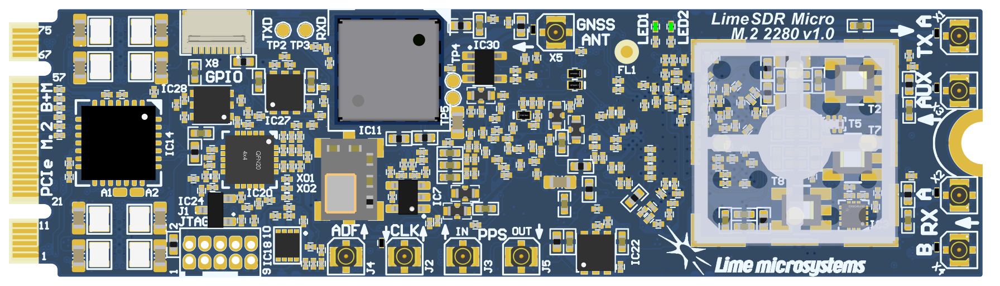
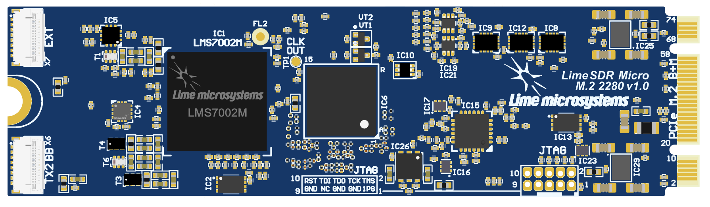
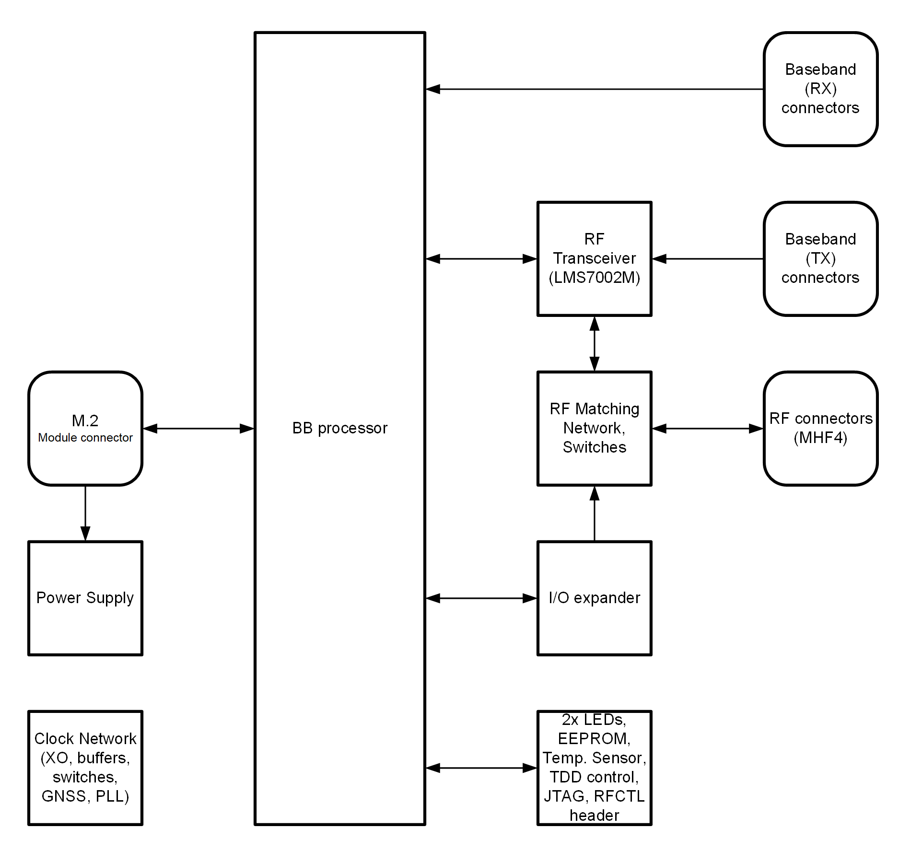
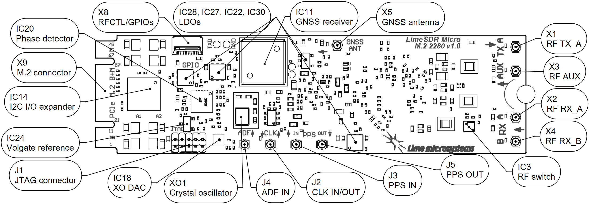
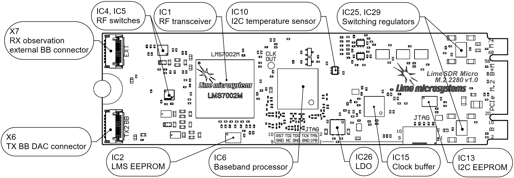
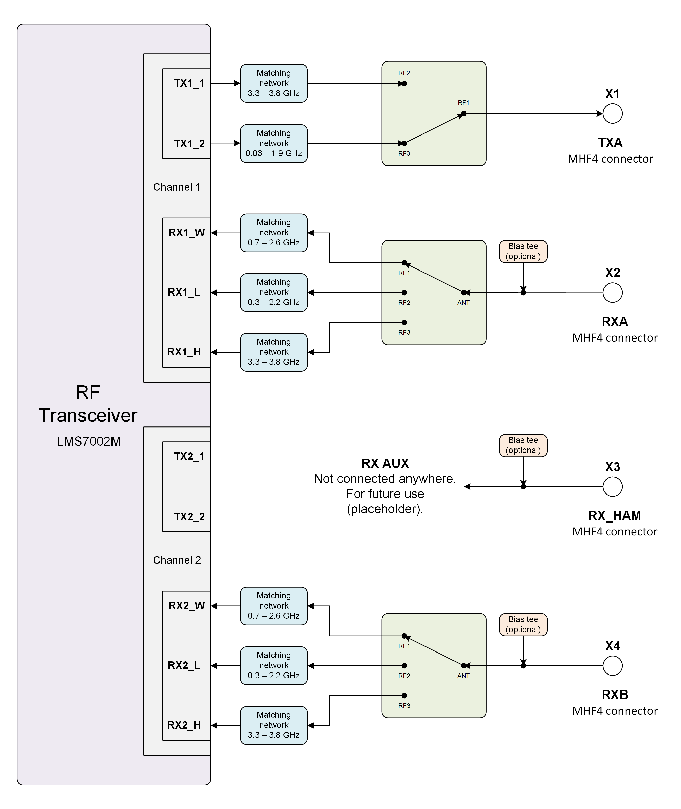
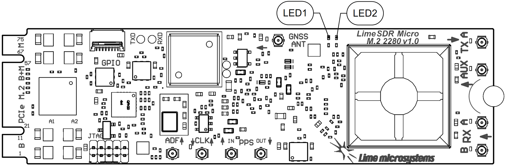
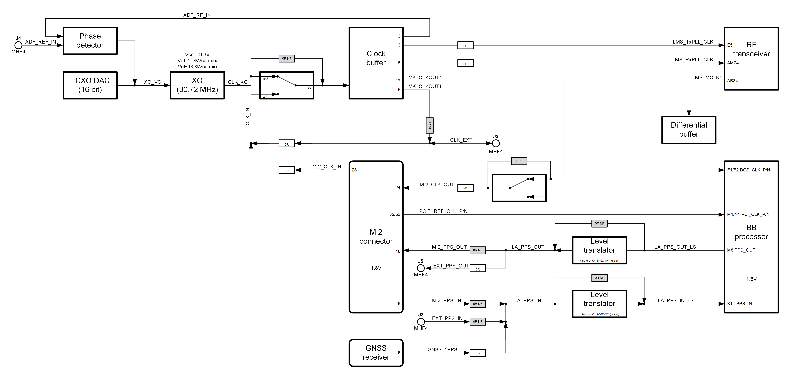
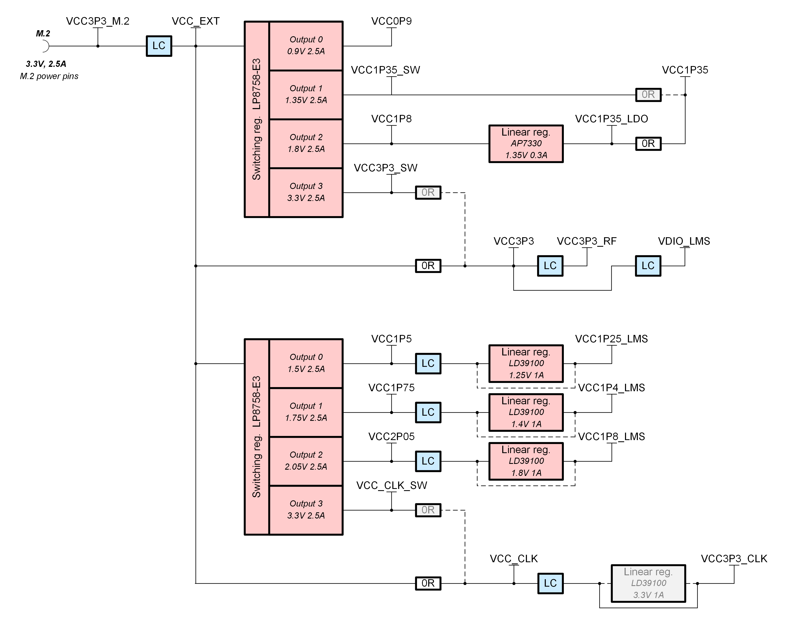

LimeSDR Micro M.2 2280 v1.0 
###########################

The LimeSDR Micro M.2 2280 represents a breakthrough in software-defined radio technology, delivering professional-grade RF capabilities in M.2 2280 form factor. 
This innovative design enables seamless integration into embedded systems while maintaining the power and flexibility demanded by modern wireless applications. 
Powered by the NXP LA9310 baseband processor and the Lime Microsystems LMS7002M RF transceiver, it provides a flexible and powerful platform for developing wireless systems and solutions. 
Designed for seamless integration with a wide range of digital processors—including ASICs, general-purpose processors (GPPs), and GPUs—it supports applications across narrowband and broadband air interfaces. 

      Figure 1: LimeSDR Micro M.2 2280 v1.0 top

      Figure 1: LimeSDR Micro M.2 2280 v1.0 bottom

LimeSDR Micro M.2 2280 board features:

* RF and BB parameters:

  * Configuration: MISO (1xTX, 2xRX)
  * Frequency range: 30 MHz – 3.8 GHz
  * Bandwidth: 30.72 MHz
  * Sample depth: 12 bit
  * Sample rate: 30.72 MSPS
  * Transmit power: max 10 dBm (depending on frequency)

* Baseband processor: board is designed based on NXP Semiconductors LA9310X7S11AA BB processor in 157-ball LFBGA package. NXP Semiconductors LA9310X7S11AA features are:

  * 157-pin LFBGA package (8mm x 8mm, 1.25mm)
  * Core type Arm Cortex-M4.
  * 307 MHz Operating frequency 
  * Integrated ADC/DAC (160 MSPS)
  * 66 kB SRAM
  * Configuration via JTAG

* RF transceiver: Lime Microsystems LMS7002M

* EEPROM Memory: 128Kb EEPROM for LMS MCU firmware (optional); 512Kb EEPROM for BB processor data (optional)

* Temperature sensor: TMP1075NDRLR

* General user inputs/outputs:

  * 2x Green LEDs
  * 4x GPIOs 3.3V in RFCTL/GPIO connector

* Connections:

  * Coaxial RF (MHF4 female) connectors
  * BB processor JTAG connector (unpopulated)
  * M.2 B+M key edge connector
  * RF Baseband 15-pin FPC connectors

* Clock system:

  * 30.72 MHz on board VCTCXO
  * VCTCXO may be tuned by on board DAC
  * Reference clock input and output connectors (MHF4 and M.2)

* Board size: 22 mm x 80 mm (M.2 2280 card form factor)

* Board power sources: M.2 (3.3V)

For more information on the following topics, refer to the respective documents:

* `Lime Microsystems LMS7002M transceiver resources <https://limemicro.com/technology/lms7002m/>`_
* `NXP Semiconductors LA9310X7S11AA base band processor resources <https://www.nxp.com/part/LA9310X7S11AA>`_

Overview
********

One of the key elements of LimeSDR Micro M.2 2280 board is NXP LA9310X7S11AA base band processor. 
It’s main function is to transfer digital data between LMS7002M RF transceiver and PC through a M.2 edge connector. 
The block diagram for LimeSDR Micro M.2 2280 board is presented in the Figure 3.

  
  Figure 3: LimeSDR Micro M.2 2280 v1.0 board block diagram

This section contains component location description on the board. 
LimeSDR Micro M.2 2280 board picture with highlighted connectors and main components are presented in Figure 4 and Figure 5, respectively. 

.. _target1:

  
  Figure 4: LimeSDR Micro M.2 2280 v1.0 board top connectors and main components

  
  Figure 5: LimeSDR Micro M.2 2280 v1.0 board bottom connectors and main components

Description of board components is given in the Table 1.

.. table:: Table 1. Board components

  +----------------------------------------------------------------------------------------------------------------------------+
  | **Featured Devices**                                                                                                       |
  +=======================+================+===================================================================================+
  | **Board   Reference** | **Type**       | **Description**                                                                   |
  +-----------------------+----------------+-----------------------------------------------------------------------------------+
  | IC1                   | RF transceiver | Lime Microsystems LMS7002M                                                        |
  +-----------------------+----------------+-----------------------------------------------------------------------------------+
  | IC6                   | BB processor   | NXP Semiconductors LA9310X7S11AA                                                  |
  +-----------------------+----------------+-----------------------------------------------------------------------------------+
  | **Miscellaneous devices**                                                                                                  |
  +-----------------------+----------------+-----------------------------------------------------------------------------------+
  | IC10                  | IC             | Temperature sensor TMP1075NDRLR                                                   |
  +-----------------------+----------------+-----------------------------------------------------------------------------------+
  | IC14                  | IC             | I2C I/O expander MCP23017-E/ML                                                    |
  +-----------------------+----------------+-----------------------------------------------------------------------------------+
  | **Configuration, Status and Setup Elements**                                                                               |
  +-----------------------+----------------+-----------------------------------------------------------------------------------+
  | J1                    | JTAG   header  | BB   processor programming ARM 10 pin 0.05" pitch header (not populated)          |
  +-----------------------+----------------+-----------------------------------------------------------------------------------+
  | LED1,   LED2          | Status LEDs    | User defined BB processor   indication green LEDs                                 |
  +-----------------------+----------------+-----------------------------------------------------------------------------------+
  | X8                    |  FPC connector | BB processor GPIOs/ RF controls                                                   |
  +-----------------------+----------------+-----------------------------------------------------------------------------------+
  | **RF Circuitry**                                                                                                           |
  +-----------------------+----------------+-----------------------------------------------------------------------------------+
  | IC5                   | IC             | SPDT RF switch                                                                    |
  +-----------------------+----------------+-----------------------------------------------------------------------------------+
  | IC3, IC4              | IC             | SP4T RF switch                                                                    |
  +-----------------------+----------------+-----------------------------------------------------------------------------------+
  | X1, X2,   X3, X4      | MHF4 connector | RF connectors                                                                     |
  +-----------------------+----------------+-----------------------------------------------------------------------------------+
  | X6                    |  FPC connector | LMS7002 base band TX DAC BB   15-pin FPC connector                                |
  +-----------------------+----------------+-----------------------------------------------------------------------------------+
  | X7                    |  FPC connector | RX obeservation externa BB   15-pin FPC connector                                 |
  +-----------------------+----------------+-----------------------------------------------------------------------------------+
  | **Memory Devices**                                                                                                         |
  +-----------------------+----------------+-----------------------------------------------------------------------------------+
  | IC2                   | IC             | I²C EEPROM Memory 128Kb (16K x   8), connected to LMS7002M RF transceiver I2C bus |
  +-----------------------+----------------+-----------------------------------------------------------------------------------+
  | IC13                  | IC             | I²C EEPROM Memory 512Kb (64K x   8), connected to BB processor I2C bus            |
  +-----------------------+----------------+-----------------------------------------------------------------------------------+
  | **Communication Ports**                                                                                                    |
  +-----------------------+----------------+-----------------------------------------------------------------------------------+
  | X9                    | M.2            | M.2 B+M key Edge connector (1x   PCIe lane)                                       |
  +-----------------------+----------------+-----------------------------------------------------------------------------------+
  | **Clock Circuitry**                                                                                                        |
  +-----------------------+----------------+-----------------------------------------------------------------------------------+
  | XO1                   | VCTCXO         | 30.72 MHz Voltage Controlled   Temperature Compensated Crystal Oscillator         |
  +-----------------------+----------------+-----------------------------------------------------------------------------------+
  | IC20                  | IC             | Phase detector                                                                    |
  +-----------------------+----------------+-----------------------------------------------------------------------------------+
  | IC15                  | IC             | Clock buffer                                                                      |
  +-----------------------+----------------+-----------------------------------------------------------------------------------+
  | IC18                  | IC             | 16 bit DAC for VCTCXO (XO1)   frequency tuning (default)                          |
  +-----------------------+----------------+-----------------------------------------------------------------------------------+
  | IC11                  | IC             | GNSS Receiver module                                                              |
  +-----------------------+----------------+-----------------------------------------------------------------------------------+
  | IC19,   IC21          | IC             | Logic level converters                                                            |
  +-----------------------+----------------+-----------------------------------------------------------------------------------+
  | IC16,   IC17          | IC             | Analogue switches                                                                 |
  +-----------------------+----------------+-----------------------------------------------------------------------------------+
  | J4                    | MHF4 connector | Reference clock input                                                             |
  +-----------------------+----------------+-----------------------------------------------------------------------------------+
  | J2                    | MHF4 connector | Reference clock output                                                            |
  +-----------------------+----------------+-----------------------------------------------------------------------------------+
  | J3                    | MHF4 connector | 1PPS input                                                                        |
  +-----------------------+----------------+-----------------------------------------------------------------------------------+
  | J5                    | MHF4 connector | 1PPS output                                                                       |
  +-----------------------+----------------+-----------------------------------------------------------------------------------+
  | X5                    | MHF4 connector | GNSS (active) antenna connector                                                   |
  +-----------------------+----------------+-----------------------------------------------------------------------------------+
  | **Power Supply**                                                                                                           |
  +-----------------------+----------------+-----------------------------------------------------------------------------------+
  | IC25,   IC26          | IC             | Four-output switching regulator   LP8758A1E0YFFR                                  |
  +-----------------------+----------------+-----------------------------------------------------------------------------------+
  | IC27,   IC28, IC29    | IC             | Linear regulator LD39100PUR                                                       |
  +-----------------------+----------------+-----------------------------------------------------------------------------------+
  | IC30                  | IC             | Linear regulator AP7330                                                           |
  +-----------------------+----------------+-----------------------------------------------------------------------------------+  

Detailed Information
********************

More detailed description of LimeSDR Micro M.2 2280 board components and interconnections is given in the following sections of this chapter.

LMS7002M RF transceiver digital connectivity
============================================

The interface and control signals are described below:

* Baseband Signals: LMS7002 is using baseband signals (I and Q) to transfer data to/from the NXP Baseband processor:

  * TX signals LMS_TX1_BB_I/Q_P/N where I/Q indicates in-phase and quadrature signals and P/N indicates differential positive and negative pairs. 
  * RX signals LMS_RX1/2_BB_I/Q_P/N where RX1/2 indicates RF channel 1 or 2, I/Q indicates I and Q signals and P/N indicates differential positive and negative pairs. 
* LMS Control Signals: these signals are used for the following functions within the LMS7002 RFIC:

  * LMS_RXEN, LMS_TXEN – receiver and transmitter enable/disable signals connected to FPGA Bank 14 (3.3V).
  * LMS_RESET – LMS7002M reset is connected to FPGA Bank 14 (3.3V).
* SPI Interface: LMS7002M transceiver is configured via 4-wire SPI interface: LA_SPI_SCLK, LA_SPI_MOSI, LA_SPI_MISO, LA_SPI_LMS_SS. The SPI interface is connected to BB processor via level converter IC8.
* LMS I2C Interface: can be used for LMS EEPROM content modification or debug purposes. The signals LMS_I2C_SCL and LMS_I2C_DATA are connected to EEPROM. They can be also connected to BB processors LA_I2C_SCL and LA_I2C_SDA.

All signals connected to LMS7002 are listed in table 2.

.. table:: Table 2. LMS7002M RF transceiver signals

    +----------------------+----------------------------+-----------------------------+-----------------------+--------------------------+----------------------------------------------+
    | **Chip   pin (IC1)** | **Chip   reference (IC1)** | **Schematic   signal name** |                       |                          | **Comment**                                  |
    |                      |                            |                             |      **BB processor** |      **BB processor**    |                                              |
    |                      |                            |                             |                       |                          |                                              |
    |                      |                            |                             |      **pin (IC6)**    |      **reference (IC6)** |                                              |
    +======================+============================+=============================+=======================+==========================+==============================================+
    | AB34                 | MCLK1                      | LMS_MCLK1                   | F1                    | DCS_CLK_P                | DCS_CLK_P                                    |
    |                      |                            |                             +-----------------------+--------------------------+----------------------------------------------+
    |                      |                            |                             | F2                    | DCS_CLK_N                | DCS_CLK_N                                    |
    +----------------------+----------------------------+-----------------------------+-----------------------+--------------------------+----------------------------------------------+
    | D28                  | SEN                        | LA_SPI_LMS_SS               | P7                    | SPI_CS0_B                | SPI   signals connected via level translator |
    +----------------------+----------------------------+-----------------------------+-----------------------+--------------------------+                                              |
    | C29                  | SCLK                       | LA_SPI_SCLK                 | P8                    | SPI_CLK                  |                                              |
    +----------------------+----------------------------+-----------------------------+-----------------------+--------------------------+                                              |
    | F30                  | SDIO                       | LA_SPI_MOSI                 | R9                    | SPI_MOSI                 |                                              |
    +----------------------+----------------------------+-----------------------------+-----------------------+--------------------------+                                              |
    | F28                  | SDO                        | LA_SPI_MISO                 | P8                    | SPI_MISO                 |                                              |
    +----------------------+----------------------------+-----------------------------+-----------------------+--------------------------+----------------------------------------------+
    | D26                  | SDA                        | LMS_I2C_SDA                 | P6   (NC)             | IIC1_SDA                 |                                              |
    |                      |                            |                             |                       |                          |      BB processor and LMS7002M I2C signals   |
    +----------------------+----------------------------+-----------------------------+-----------------------+--------------------------+                                              |
    | C27                  | SCL                        | LMS_I2C_SCL                 | R6   (NC)             | IIC1_SCL                 |      are not connected by default            |
    +----------------------+----------------------------+-----------------------------+-----------------------+--------------------------+----------------------------------------------+
    | T4                   | tbbip_pad_1                | LMS_TX1_BB_I_P              | A7                    | TX_I_P                   | RF   channel 1 TX baseband I data            |
    +----------------------+----------------------------+-----------------------------+-----------------------+--------------------------+                                              |
    | R5                   | tbbin_pad_1                | LMS_TX1_BB_I_N              | B7                    | TX_I_N                   |                                              |
    +----------------------+----------------------------+-----------------------------+-----------------------+--------------------------+----------------------------------------------+
    | R3                   | tbbqp_pad_1                | LMS_TX1_BB_Q_P              | A9                    | TX_Q_P                   | RF   channel 1 TX baseband Q data            |
    +----------------------+----------------------------+-----------------------------+-----------------------+--------------------------+                                              |
    | P2                   | tbbqn_pad_1                | LMS_TX1_BB_Q_N              | B9                    | TX_Q_N                   |                                              |
    +----------------------+----------------------------+-----------------------------+-----------------------+--------------------------+----------------------------------------------+
    | V2                   | tbbip_pad_2                | LMS_TX2_BB_I_P              |                       |                          | Connected toX6 pin 2 (RF2 TX NC)             |
    +----------------------+----------------------------+-----------------------------+-----------------------+--------------------------+----------------------------------------------+
    | T6                   | tbbin_pad_2                | LMS_TX2_BB_I_N              |                       |                          | Connected to X6 pin 3 (RF2 TX NC)            |
    +----------------------+----------------------------+-----------------------------+-----------------------+--------------------------+----------------------------------------------+
    | U3                   | tbbqp_pad_2                | LMS_TX2_BB_Q_P              |                       |                          | Connected to X6 pin 5 (RF2 TX NC)            |
    +----------------------+----------------------------+-----------------------------+-----------------------+--------------------------+----------------------------------------------+
    | U1                   | tbbqn_pad_2                | LMS_TX2_BB_Q_N              |                       |                          | Connected to X6 pin 6 (RF2 TX NC)            |
    +----------------------+----------------------------+-----------------------------+-----------------------+--------------------------+----------------------------------------------+
    | Y6                   | rbbip_pad_1                | LMS_RX1_BB_I_P              | B4                    | RX0_I_P                  | RF   channel 1 RX baseband I data            |
    +----------------------+----------------------------+-----------------------------+-----------------------+--------------------------+                                              |
    | AB2                  | rbbin_pad_1                | LMS_RX1_BB_I_N              | A4                    | RX0_I_N                  |                                              |
    +----------------------+----------------------------+-----------------------------+-----------------------+--------------------------+----------------------------------------------+
    | AB4                  | rbbqp_pad_1                | LMS_RX1_BB_Q_P              | A6                    | RX0_Q_P                  | RF   channel 1 RX baseband Q data            |
    +----------------------+----------------------------+-----------------------------+-----------------------+--------------------------+                                              |
    | AA5                  | rbbqn_pad_1                | LMS_RX1_BB_Q_N              | B6                    | RX0_Q_N                  |                                              |
    +----------------------+----------------------------+-----------------------------+-----------------------+--------------------------+----------------------------------------------+
    | AD2                  | rbbip_pad_2                | LMS_RX2_BB_I_P              | A10                   | RX1_I_P                  | RF   channel 2 RX baseband I data            |
    +----------------------+----------------------------+-----------------------------+-----------------------+--------------------------+                                              |
    | AC3                  | rbbin_pad_2                | LMS_RX2_BB_I_N              | B10                   | RX1_I_N                  |                                              |
    +----------------------+----------------------------+-----------------------------+-----------------------+--------------------------+----------------------------------------------+
    | AC5                  | rbbqp_pad_2                | LMS_RX2_BB_Q_P              | B12                   | RX1_Q_P                  | RF   channel 2 RX baseband Q data            |
    +----------------------+----------------------------+-----------------------------+-----------------------+--------------------------+                                              |
    | AB6                  | rbbqn_pad_2                | LMS_RX2_BB_Q_N              | A12                   | RX1_Q_N                  |                                              |
    +----------------------+----------------------------+-----------------------------+-----------------------+--------------------------+----------------------------------------------+
    | E5                   | xoscin_tx                  | LMS_TX_CLK                  |                       |                          | Connected to 30.72 MHz clock                 |
    +----------------------+----------------------------+-----------------------------+-----------------------+--------------------------+----------------------------------------------+
    | AM24                 | xoscin_rx                  | LMS_RxPLL_CLK               |                       |                          | Connected to 30.72 MHz clock                 |
    +----------------------+----------------------------+-----------------------------+-----------------------+--------------------------+----------------------------------------------+
    | E27                  | RESET                      | LMS_RESET                   |                       |                          | I/O expander GPA0                            |
    +----------------------+----------------------------+-----------------------------+-----------------------+--------------------------+----------------------------------------------+
    | U29                  | TXEN                       | LMS_TXEN                    |                       |                          | Pulled-up by R11                             |
    +----------------------+----------------------------+-----------------------------+-----------------------+--------------------------+----------------------------------------------+
    | V34                  | RXEN                       | LMS_RXEN                    |                       |                          | Pulled-up by R12                             |
    +----------------------+----------------------------+-----------------------------+-----------------------+--------------------------+----------------------------------------------+
    | U33                  | CORE_LDO_EN                | LMS_CORE_LDO_EN             |                       |                          | Pulled-up by R13                             |
    +----------------------+----------------------------+-----------------------------+-----------------------+--------------------------+----------------------------------------------+
    | V30                  | LOGIC_RESET                |                             |                       |                          | GND                                          |
    +----------------------+----------------------------+-----------------------------+-----------------------+--------------------------+----------------------------------------------+

Baseband connectors
===================

Baseband signals can be accessed 
via 0.3mm pitch 15 pin FPC connectors. NXP base band processors RX observation external connector (X7) pinout is shown in Table 3. 
LMS7002M TX ADC connector (X6) pinout is shown in Table 4.

.. table:: Table 3. Basedand processors RX obeservation external BB 15-pin FPC connector (X7)

    +---------+-----------------------------+-----------------------------------------------------+
    | **Pin** | **Schematic signal   name** | **Description**                                     |
    +=========+=============================+=====================================================+
    | 1       | GND                         | Ground                                              |
    +---------+-----------------------------+-----------------------------------------------------+
    | 2       | LA_RO0_EXT_I_P              | Channel 1 in-phase   signal differential positive   |
    +---------+-----------------------------+-----------------------------------------------------+
    | 3       | LA_RO0_EXT_I_N              | Channel 1 in-phase   signal differential negative   |
    +---------+-----------------------------+-----------------------------------------------------+
    | 4       | GND                         | Ground                                              |
    +---------+-----------------------------+-----------------------------------------------------+
    | 5       | LA_RO0_EXT_Q_P              | Channel 1 quadrature   signal differential positive |
    +---------+-----------------------------+-----------------------------------------------------+
    | 6       | LA_RO0_EXT_Q_N              | Channel 1 quadrature   signal differential negative |
    +---------+-----------------------------+-----------------------------------------------------+
    | 7       | GND                         | Ground                                              |
    +---------+-----------------------------+-----------------------------------------------------+
    | 8       | VCC3P3                      | Power (3.3 V)                                       |
    +---------+-----------------------------+-----------------------------------------------------+
    | 9       | GND                         | Ground                                              |
    +---------+-----------------------------+-----------------------------------------------------+
    | 10      | LA_RO1_EXT_I_P              | Channel 2 in-phase   signal differential positive   |
    +---------+-----------------------------+-----------------------------------------------------+
    | 11      | LA_RO1_EXT_I_N              | Channel 2 in-phase   signal differential negative   |
    +---------+-----------------------------+-----------------------------------------------------+
    | 12      | GND                         | Ground                                              |
    +---------+-----------------------------+-----------------------------------------------------+
    | 13      | LA_RO1_EXT_Q_P              | Channel 2 quadrature   signal differential positive |
    +---------+-----------------------------+-----------------------------------------------------+
    | 14      | LA_RO1_EXT_Q_N              | Channel 2 quadrature   signal differential negative |
    +---------+-----------------------------+-----------------------------------------------------+
    | 15      | GND                         | Ground                                              |
    +---------+-----------------------------+-----------------------------------------------------+

.. table:: Table 4. LMS7002 base band TX DAC connector (X6)

    +---------+-----------------------------+-----------------------------------------------------+
    | **Pin** | **Schematic signal   name** | **Description**                                     |
    +=========+=============================+=====================================================+
    | 1       | GND                         | Ground                                              |
    +---------+-----------------------------+-----------------------------------------------------+
    | 2       | LMS_TX2_BB_I_P              | Channel 1 in-phase   signal differential positive   |
    +---------+-----------------------------+-----------------------------------------------------+
    | 3       | LMS_TX2_BB_I_N              | Channel 1 in-phase   signal differential negative   |
    +---------+-----------------------------+-----------------------------------------------------+
    | 4       | GND                         | Ground                                              |
    +---------+-----------------------------+-----------------------------------------------------+
    | 5       | LMS_TX2_BB_Q_P              | Channel 1 quadrature   signal differential positive |
    +---------+-----------------------------+-----------------------------------------------------+
    | 6       | LMS_TX2_BB_Q_N              | Channel 1 quadrature   signal differential negative |
    +---------+-----------------------------+-----------------------------------------------------+
    | 7       | GND                         | Ground                                              |
    +---------+-----------------------------+-----------------------------------------------------+
    | 8       | VCC3P3                      | Power (3.3 V)                                       |
    +---------+-----------------------------+-----------------------------------------------------+
    | 9       | GND                         | Ground                                              |
    +---------+-----------------------------+-----------------------------------------------------+
    | 10      | NC                          | No connection                                       |
    +---------+-----------------------------+-----------------------------------------------------+
    | 11      | NC                          | No connection                                       |
    +---------+-----------------------------+-----------------------------------------------------+
    | 12      | GND                         | Ground                                              |
    +---------+-----------------------------+-----------------------------------------------------+
    | 13      | NC                          | No connection                                       |
    +---------+-----------------------------+-----------------------------------------------------+
    | 14      | NC                          | No connection                                       |
    +---------+-----------------------------+-----------------------------------------------------+
    | 15      | GND                         | Ground                                              |
    +---------+-----------------------------+-----------------------------------------------------+

RF network control signals
==========================

LimeSDR Micro M.2 2280 RF network contains matching networks, RF switches and MHF4 connectors 
(X1 - TX and X2, X4 - RX) as shown in Figure 6.

  
  Figure 6: LimeSDR Micro M.2 2280 v1.0 RF diagram

LMS7002M RF transceiver TX and RX ports has dedicated matching network which determines the 
working frequency range. More detailed information on LMS7002M RF transceiver ports and matching 
network frequency ranges is listed in the Table 5.

.. table:: Table 5. LMS7002M RF transceiver ports and matching networks frequency ranges

    +----------------------------------+---------------------+
    | **LMS7002M RF transceiver port** | **Frequency range** |
    +==================================+=====================+
    | TX1_1                            | 3.3 GHz - 3.8 GHz   |
    +----------------------------------+---------------------+
    | TX1_2                            | 0.03 GHz - 1.9 GHz  |
    +----------------------------------+---------------------+
    | RX1_H,   RX2_H                   | 3.3 GHz - 3.8 GHz   |
    +----------------------------------+---------------------+
    | RX1_W,   RX2_W                   | 0.7 GHz - 2.6 GHz   |
    +----------------------------------+---------------------+
    | RX1_L,   RX2_L                   | 0.3 MHz – 2.2 GHz   |
    +----------------------------------+---------------------+

RF network switches are controlled via 2.4V logic signals. 
This is achieved by resistor dividers connected between I2C GPIO expander (TX_SW, RX_SW2, RX_SW3) and switch 
control pin (TX_SW_DIV, RX_SW2_DIV, RX_S3_DIV). RF network control signals are described in the Table 6.

.. table:: Table 6. RF network control signals

    +-----------------------------+-----------------------------+------------------+----------------------------+--------------------------------------------------------+
    | **Component**               | **Schematic signal   name** | **I/O standard** | **I2C I/O expander   pin** | **Description**                                        |
    +=============================+=============================+==================+============================+========================================================+
    | SKY13330-397LF(IC5)         | TX_SW/TX_SW_DIV             | 3.3V             | GPB1                       | 3.3V logic level   signal divided to 2.4V logic level. |
    +-----------------------------+-----------------------------+------------------+----------------------------+--------------------------------------------------------+
    | SKY13414-485LF(IC3 and IC4) | RX_SW2/RX_SW2_DIV           | 3.3V             | GPB0                       | 3.3V logic level   signal divided to 2.4V logic level. |
    |                             +-----------------------------+------------------+----------------------------+--------------------------------------------------------+
    |                             | RX_SW3/RX_SW3_DIV           | 3.3V             | GPB2                       | 3.3V logic level   signal divided to 2.4V logic level. |
    +-----------------------------+-----------------------------+------------------+----------------------------+--------------------------------------------------------+

Indication LEDs
===============

LimeSDR Micro M.2 2280 board comes with two green indicator LEDs. These LEDs are soldered on the top of the board near RF shield (rigth edge). 

  
  Figure 7: LimeSDR Micro M.2 2280 v1.0 indication LEDs (top)

LEDs are connected to baseband processors GPIOs hence their function may be programmed according to the user requirements. 
Default LEDs configuration and description are shown in Table 7.

.. table:: Table 7. Default LEDs configuration

    +-----------------------+--------------------+-----------------+----------------------+-----------------+
    | **Board   Reference** | **Schematic name** | **Board label** | **BB processor pin** | **Description** |
    +=======================+====================+=================+======================+=================+
    | LED1                  | LA_LED1            | LED1            | R11 (GPIO_17)        | User defined    |
    +-----------------------+--------------------+-----------------+----------------------+-----------------+
    | LED2                  | LA_LED2            | LED2            | P12 (GPIO_18)        | User defined    |
    +-----------------------+--------------------+-----------------+----------------------+-----------------+

Low speed interfaces
====================

Baseband processors SPI (LA_SPI) pins, schematic signal names and I/O standards/levels are shown in Table 8.

.. table:: Table 8. LA_SPI interface pins

    +-----------------------------+----------------------+------------------+---------------------------------------------+
    | **Schematic   signal name** | **BB processor pin** | **I/O standard** | **Comment**                                 |
    +=============================+======================+==================+=============================================+
    | LA_SPI_SCLK                 | P8                   | 3.3V             | Serial Clock (LA output)                    |
    +-----------------------------+----------------------+------------------+---------------------------------------------+
    | LA_SPI_MOSI                 | R9                   | 3.3V             | Data (LA output)                            |
    +-----------------------------+----------------------+------------------+---------------------------------------------+
    | LA_SPI_MISO                 | R8                   | 3.3V             | Data (LA input)                             |
    +-----------------------------+----------------------+------------------+---------------------------------------------+
    | LA_SPI_LMS_SS               | P7                   | 3.3V             | IC1 (LMS7002) SPI slave select (LA output)  |
    +-----------------------------+----------------------+------------------+---------------------------------------------+
    | LA_SPI_ADF_SS_LS            | P11                  | 3.3V             | IC20 (ADF4002) SPI slave select (LA output) |
    +-----------------------------+----------------------+------------------+---------------------------------------------+

Baseband processors I2C (LA_I2C)  
interface slave devices (temperature sensor, EEPROM, I/O expander, CLK DAC and switching regulators) and related information are given in Table 9.

.. table:: Table 9. LA_I2C interfaces pins

    +------------------------+---------------------+--------------------------------------+
    | **I2C   slave device** | **Slave device**    | **I2C address**                      |
    +========================+=====================+======================================+
    | IC10                   | Temperature sensor  | 1 0 0 1 0 1 1 RW                     |
    +------------------------+---------------------+--------------------------------------+
    | IC13                   | EEPROM              | 1 0 1 0 0 0 0 RW                     |
    +------------------------+---------------------+--------------------------------------+
    | IC14                   | I/O expander        | 0 1 0 0 0 0 0 RW                     |
    +------------------------+---------------------+--------------------------------------+
    | IC18                   | XO DAC              | 1 0 0 1 1 0 0 RW                     |
    +------------------------+---------------------+--------------------------------------+
    | IC25                   | Switching regulator | 1 1 0 0 0 0 0 RW (I2C_SDA_SEL =   0) |
    +------------------------+---------------------+--------------------------------------+
    | IC29                   | Switching regulator | 1 1 0 0 0 0 0 RW (I2C_SDA_SEL =   1) |
    +------------------------+---------------------+--------------------------------------+

Switching regulators (IC25 and IC29) share identical I2C address, switching between them 
is done by I2C_SDA_SEL signal connected to I2C I/O expanders GPB3.

To debug Baseband processors design 10-pin 0.05" pitch JTAG connector is used (J1). 
It is located on the PCB top side (see :ref:`target1`) and is not populated by default. 
JTAG connector pins, schematic signal names and I/O standards are listed 
in Table 10. 

.. table:: Table 10. JTAG connector J1 pins

    +-------------------+---------------------------+----------------------+------------------+------------------+
    | **Connector pin** | **Schematic signal name** | **BB processor pin** | **I/O standard** | **Comment**      |
    +===================+===========================+======================+==================+==================+
    | 1                 | VCC1P8                    |                      | 1.8V             | Power (1.8V)     |
    +-------------------+---------------------------+----------------------+------------------+------------------+
    | 2                 | TMS                       | M12                  | 1.8V             | Test Mode Select |
    +-------------------+---------------------------+----------------------+------------------+------------------+
    | 3                 | GND                       |                      |                  | Ground           |
    +-------------------+---------------------------+----------------------+------------------+------------------+
    | 4                 | TCK                       | N10                  | 1.8V             | Test Clock       |
    +-------------------+---------------------------+----------------------+------------------+------------------+
    | 5                 | GND                       |                      |                  | Ground           |
    +-------------------+---------------------------+----------------------+------------------+------------------+
    | 6                 | TDO                       | N12                  | 1.8V             | Test Data Output |
    +-------------------+---------------------------+----------------------+------------------+------------------+
    | 7                 | NC                        |                      |                  | No Connection    |
    +-------------------+---------------------------+----------------------+------------------+------------------+
    | 8                 | TDI                       | M10                  | 1.8V             | Test Data Input  |
    +-------------------+---------------------------+----------------------+------------------+------------------+
    | 9                 | GND                       |                      |                  | Ground           |
    +-------------------+---------------------------+----------------------+------------------+------------------+
    | 10                | RST                       | N8                   | 1.8V             | Reset            |
    +-------------------+---------------------------+----------------------+------------------+------------------+

GPIO connectors
===============

Three base band processors RF control/GPIOs and one I2C GPIO expander pin are connected 
to 8 pin FPC connector (X8). Additionaly one pin is dedicated for power (3.3V) and every other pin 
is ground as shown in table 11.  

.. table:: Table 11. RFCTL/ GPIOs connector (X8) pins

    +-------------------+---------------------------+----------------------+------------------+---------------------+
    | **Connector pin** | **Schematic signal name** | **BB processor pin** | **I/O standard** | **Comment**         |
    +===================+===========================+======================+==================+=====================+
    | 1                 | VCC3P3                    |                      | 3.3V             | Power (3.3V)        |
    +-------------------+---------------------------+----------------------+------------------+---------------------+
    | 2                 | LA_TRX0                   | M14                  | 3.3V             | TXRX0/GPIO7         |
    +-------------------+---------------------------+----------------------+------------------+---------------------+
    | 3                 | GND                       |                      | 3.3V             | Ground              |
    +-------------------+---------------------------+----------------------+------------------+---------------------+
    | 4                 | LA_PA_EN                  | P14                  | 3.3V             | PA_EN/GPIO12        |
    +-------------------+---------------------------+----------------------+------------------+---------------------+
    | 5                 | GND                       |                      | 3.3V             | Ground              |
    +-------------------+---------------------------+----------------------+------------------+---------------------+
    | 6                 | LA_LNA1_EN                | M15                  | 3.3V             | LNA1_EN/GPIO11      |
    +-------------------+---------------------------+----------------------+------------------+---------------------+
    | 7                 | GND                       |                      | 3.3V             | Ground              |
    +-------------------+---------------------------+----------------------+------------------+---------------------+
    | 8                 | EXP_GPA2                  | GPIO EXP (GPA2)      | 3.3V             | I2C GPIO   expander |
    +-------------------+---------------------------+----------------------+------------------+---------------------+

Clock Distribution
==================

LimeSDR Micro M.2 2280 board clock distribution block diagram is as shown in Figure 8.

  
  Figure 8: LimeSDR Micro M.2 2280 v1.0 board clock distribution block diagram

LimeSDR XTRX board features an on board 30.72 MHz VCTCXO as the reference clock for 
LMS7002M RF transceiver.

Rakon E6245LF 30.72 MHz voltage controlled temperature compensated crystal oscillator (VCTCXO) 
is the clock source for the board. VCTCXO frequency may be tuned by using 16 bit DAC (IC18). 
Main VCTCXO parameters are listed in Table 12.

.. table:: Table 12. Rakon E6245LF VCTCXO main parameters

    +------------------------------------+---------------+
    | **Frequency   parameter**          | **Value**     |
    +====================================+===============+
    | Calibration   (25°C ± 1°C)         | ± 1 ppm max   |
    +------------------------------------+---------------+
    | Stability   (-40 to 85 °C)         | ± 50 ppb max  |
    +------------------------------------+---------------+
    | Long term   stability (first year) | ± 1.5 ppm max |
    +------------------------------------+---------------+
    | Control   voltage range            | 0.5V .. 2.5V  |
    +------------------------------------+---------------+
    | Frequency   tuning                 | ± 5 ppm       |
    +------------------------------------+---------------+
    | Slope                              | +7.5 ppm/V    |
    +------------------------------------+---------------+

Analogue switch (IC16) gives option to select clock source for clock buffered from 
onboard VCTCXO clock XO1 (CLK_XO) and external MHF4 (J2)/M.2 (X9) sources (CLK_IN). Buffered clock signal 
(LMK_CLKOUT1 and LMK_CLKOUT4) can also be fed to other board using MHF4 (XJ2)/M.2 (X9) connectors.

The board clock lines and other related signals/information are listed in Table 13.

.. table:: Table 13. LimeSDR Micro M.2 2280 main clock lines

    +----------------------+---------------------------+------------------+-----------------------------------------------------+
    | **Source**           | **Schematic signal name** | **I/O standard** | **Description**                                     |
    +======================+===========================+==================+=====================================================+
    | External (J2)        | CLK_IN                    | 3.3V             | External reference clock input (MHF4)               |
    +----------------------+---------------------------+------------------+-----------------------------------------------------+
    | Clock buffer (IC15)  | LMK_CLKOUT1               | 3.3V             | Reference clock output (MHF4)                       |
    |                      +---------------------------+------------------+-----------------------------------------------------+
    |                      | LMK_CLKOUT4               | 1.8V             | Reference clock output (M.2)                        |
    |                      +---------------------------+------------------+-----------------------------------------------------+
    |                      | LMS_TxPLL_CLK             | 1.8V             | Reference clock connected to LMS (TX)               |
    |                      +---------------------------+------------------+-----------------------------------------------------+
    |                      | LMS_RxPLL_CLK             | 1.8V             | Reference clock connected to LMS (RX)               |
    |                      +---------------------------+------------------+-----------------------------------------------------+
    |                      | ADF_RF_IN                 | 3.3V             | Reference clock connected to ADF (phase   detector) |
    +----------------------+---------------------------+------------------+-----------------------------------------------------+
    | VCTCXO (XO1)         | CLK_XO                    | 3.3V             | Onboard reference clock                             |
    +----------------------+---------------------------+------------------+-----------------------------------------------------+
    |                      | PCIE_REF_CLK_P            |                  |                                                     |
    | External (M.2)       +---------------------------+ 1.8V (diff)      | PCIe reference clock                                |
    |                      | PCIE_REF_CLK_N            |                  |                                                     |
    +----------------------+---------------------------+------------------+-----------------------------------------------------+
    | RF tranceiver (IC1)  | LMS_MCLK1                 | 3.3V             | Reference clock connected to BB processor           |
    +----------------------+---------------------------+------------------+-----------------------------------------------------+
    | GNSS Receiver (IC11) | GNSS_1PPS                 | 3.3V             | PPS output from GNSS receiver for BB   processor    |
    +----------------------+---------------------------+------------------+-----------------------------------------------------+
    | External  (J3)       | EXT_PPS_IN                | 3.3V             | External PPS input (MHF4)                           |
    +----------------------+---------------------------+------------------+-----------------------------------------------------+
    | External   (M.2)     | M.2_PPS_IN                | 3.3V             | External PPS input (M.2)                            |
    +----------------------+---------------------------+------------------+-----------------------------------------------------+
    | BB processor   (IC6) | M.2_PPS_OUT               | 3.3V             | M.2 PPS output                                      |
    |                      +---------------------------+------------------+-----------------------------------------------------+
    |                      | EXT_PPS_OUT               | 3.3V             | External PPS output (J5)                            |
    +----------------------+---------------------------+------------------+-----------------------------------------------------+

M.2 edge connector
==================

LimeSDR Micro M.2 2280 board communicates with the host system via M.2 edge connector. 
It is configured to use PCIE-based SSD drive pinout when sloted into key M+B socket, 
but is also compatible with key M and key B sockets. 
LimeSDR Micro M.2 2280 connector pinout and signals according to the specification is given in Table 14.

.. table:: Table 14. M.2 key M+B PCIe-based SSD edge connector pinout 

  +---------+------------------------------+----------------------------------------------------+-----------------------------------------------------------+
  | **Pin** | **M.2 PCIe   Specification** | **LimeSDR Micro   M.2 2280 Schematic signal name** | **Description**                                           |
  +=========+==============================+====================================================+===========================================================+
  | 1       | CONFIG_3 = GND               | GND                                                | Ground                                                    |
  +---------+------------------------------+----------------------------------------------------+-----------------------------------------------------------+
  | 2       | 3.3 V                        | VCC3P3_M.2                                         | Main power input 3.3 V   (VCC3P3_M.2)                     |
  +---------+------------------------------+----------------------------------------------------+-----------------------------------------------------------+
  | 3       | GND                          | GND                                                | Ground                                                    |
  +---------+------------------------------+----------------------------------------------------+-----------------------------------------------------------+
  | 4       | 3.3 V                        | VCC3P3_M.2                                         | Main power input 3.3 V   (VCC3P3_M.2)                     |
  +---------+------------------------------+----------------------------------------------------+-----------------------------------------------------------+
  | 5       | NC                           | NC                                                 | No connection                                             |
  +---------+------------------------------+----------------------------------------------------+-----------------------------------------------------------+
  | 6       | NC                           | NC                                                 | No connection                                             |
  +---------+------------------------------+----------------------------------------------------+-----------------------------------------------------------+
  | 7       | NC                           | NC                                                 | No connection                                             |
  +---------+------------------------------+----------------------------------------------------+-----------------------------------------------------------+
  | 8       | PLN# (I)(0/1.8/3.3V)         | PCIE_W_DISABLE1#                                   | Wireless disable                                          |
  +---------+------------------------------+----------------------------------------------------+-----------------------------------------------------------+
  | 9       | NC                           | NC                                                 | No connection                                             |
  +---------+------------------------------+----------------------------------------------------+-----------------------------------------------------------+
  | 10      | LED_1# (O)(OD)               | M.2_LED1#                                          | PCIe activity indication (can be   routed to onboard LED) |
  +---------+------------------------------+----------------------------------------------------+-----------------------------------------------------------+
  | 11      | NC                           | NC                                                 | No connection                                             |
  +---------+------------------------------+----------------------------------------------------+-----------------------------------------------------------+
  | 12      |                                                                                                                                               |
  +---------+                                                                                                                                               |
  | 13      |                                                                                                                                               |
  +---------+                                                                                                                                               |
  | 14      |                                                                                                                                               |
  +---------+                                                                                                                                               |
  | 15      |                                                                                                                                               |
  +---------+                                                               ADD-IN CARD KEY B                                                               |
  | 16      |                                                                                                                                               |
  +---------+                                                                                                                                               |
  | 17      |                                                                                                                                               |
  +---------+                                                                                                                                               |
  | 18      |                                                                                                                                               |
  +---------+                                                                                                                                               |
  | 19      |                                                                                                                                               |
  +---------+------------------------------+----------------------------------------------------+-----------------------------------------------------------+
  | 20      | NC                           | M.2_LNA1_EN                                        | Low-noise amplifier enable   (output)                     |
  +---------+------------------------------+----------------------------------------------------+-----------------------------------------------------------+
  | 21      | CONFIG_0 = GND               | GND                                                | Ground                                                    |
  +---------+------------------------------+----------------------------------------------------+-----------------------------------------------------------+
  | 22      | NC                           | M.2_PA_EN                                          | Power amplifier enable (output)                           |
  +---------+------------------------------+----------------------------------------------------+-----------------------------------------------------------+
  | 23      | NC                           | NC                                                 | No connection                                             |
  +---------+------------------------------+----------------------------------------------------+-----------------------------------------------------------+
  | 24      | NC                           | M.2_CLK_OUT                                        | Reference clock output                                    |
  +---------+------------------------------+----------------------------------------------------+-----------------------------------------------------------+
  | 25      | NC                           | NC                                                 | No connection                                             |
  +---------+------------------------------+----------------------------------------------------+-----------------------------------------------------------+
  | 26      | NC                           | PCIE_W_DISABLE2#                                   | Wireless disable                                          |
  +---------+------------------------------+----------------------------------------------------+-----------------------------------------------------------+
  | 27      | GND                          | GND                                                | Ground                                                    |
  +---------+------------------------------+----------------------------------------------------+-----------------------------------------------------------+
  | 28      | PLA_S2# (O) (0/1.8V))        | M.2_CLK_IN                                         | Reference clock input                                     |
  +---------+------------------------------+----------------------------------------------------+-----------------------------------------------------------+
  | 29      | PETn1                        | NC                                                 | No connection                                             |
  +---------+------------------------------+----------------------------------------------------+-----------------------------------------------------------+
  | 30      | NC                           | NC                                                 | No connection                                             |
  +---------+------------------------------+----------------------------------------------------+-----------------------------------------------------------+
  | 31      | PETp1                        | NC                                                 | No connection                                             |
  +---------+------------------------------+----------------------------------------------------+-----------------------------------------------------------+
  | 32      | NC                           | NC                                                 | No connection                                             |
  +---------+------------------------------+----------------------------------------------------+-----------------------------------------------------------+
  | 33      | GND                          | GND                                                | Ground                                                    |
  +---------+------------------------------+----------------------------------------------------+-----------------------------------------------------------+
  | 34      | NC                           | NC                                                 | No connection                                             |
  +---------+------------------------------+----------------------------------------------------+-----------------------------------------------------------+
  | 35      | PERn1                        | NC                                                 | No connection                                             |
  +---------+------------------------------+----------------------------------------------------+-----------------------------------------------------------+
  | 36      | NC                           | NC                                                 | No connection                                             |
  +---------+------------------------------+----------------------------------------------------+-----------------------------------------------------------+
  | 37      | PERp1                        | NC                                                 | No connection                                             |
  +---------+------------------------------+----------------------------------------------------+-----------------------------------------------------------+
  | 38      | NC                           | NC                                                 | No connection                                             |
  +---------+------------------------------+----------------------------------------------------+-----------------------------------------------------------+
  | 39      | GND                          | GND                                                | Ground                                                    |
  +---------+------------------------------+----------------------------------------------------+-----------------------------------------------------------+
  | 40      | SMB_CLK (I/O)(0/1.8V)        | M.2_TRX0                                           | TDD control (output)                                      |
  +---------+------------------------------+----------------------------------------------------+-----------------------------------------------------------+
  | 41      | PETn0                        | PCIE_PET0_N                                        | PCIe data input                                           |
  +---------+------------------------------+----------------------------------------------------+-----------------------------------------------------------+
  | 42      | SMB_DATA (I/O)(0/1.8V)       | M.2_GPIO_1                                         | BB processor general puprose I/O                          |
  +---------+------------------------------+----------------------------------------------------+-----------------------------------------------------------+
  | 43      | PETp0                        | PCIE_PET0_P                                        | PCIe data input                                           |
  +---------+------------------------------+----------------------------------------------------+-----------------------------------------------------------+
  | 44      | ALERT# (O)(0/1.8V)           | M.2_GPIO_2                                         | BB processor general puprose I/O                          |
  +---------+------------------------------+----------------------------------------------------+-----------------------------------------------------------+
  | 45      | GND                          | GND                                                | Ground                                                    |
  +---------+------------------------------+----------------------------------------------------+-----------------------------------------------------------+
  | 46      | NC                           | M.2_PPS_IN                                         | PPS input                                                 |
  +---------+------------------------------+----------------------------------------------------+-----------------------------------------------------------+
  | 47      | PERn0                        | PCIE_PER0_N                                        | PCIe data output                                          |
  +---------+------------------------------+----------------------------------------------------+-----------------------------------------------------------+
  | 48      | NC                           | M.2_PPS_OUT                                        | PPS output                                                |
  +---------+------------------------------+----------------------------------------------------+-----------------------------------------------------------+
  | 49      | PERp0                        | PCIE_PER0_P                                        | PCIe data output                                          |
  +---------+------------------------------+----------------------------------------------------+-----------------------------------------------------------+
  | 50      | PERST# (I)(0/1.8V/3.3V)      | PCIE_PERST#                                        | PCIE reset                                                |
  +---------+------------------------------+----------------------------------------------------+-----------------------------------------------------------+
  | 51      | GND                          | GND                                                | Ground                                                    |
  +---------+------------------------------+----------------------------------------------------+-----------------------------------------------------------+
  | 52      | CLKREQ# (I/O)(0/1.8V/3.3V)   | CLK_REQUEST#                                       | PCIe clock request                                        |
  +---------+------------------------------+----------------------------------------------------+-----------------------------------------------------------+
  | 53      | REFCLKn                      | PCIE_REF_CLK_N                                     | PCIe reference clock                                      |
  +---------+------------------------------+----------------------------------------------------+-----------------------------------------------------------+
  | 54      | PEWAKE# (I/O)(0/1.8V/3.3V)   | NC                                                 | No connection                                             |
  +---------+------------------------------+----------------------------------------------------+-----------------------------------------------------------+
  | 55      | REFCLKp                      | PCIE_REF_CLK_P                                     | PCIe reference clock                                      |
  +---------+------------------------------+----------------------------------------------------+-----------------------------------------------------------+
  | 56      | Reserved for MFG_DATA        | NC                                                 | No connection                                             |
  +---------+------------------------------+----------------------------------------------------+-----------------------------------------------------------+
  | 57      | GND                          | GND                                                | Ground                                                    |
  +---------+------------------------------+----------------------------------------------------+-----------------------------------------------------------+
  | 58      | Reserved for MFG_CLOCK       | NC                                                 | No connection                                             |
  +---------+------------------------------+----------------------------------------------------+-----------------------------------------------------------+
  | 59      |                                                                                                                                               |
  +---------+                                                                                                                                               |
  | 60      |                                                                                                                                               |
  +---------+                                                                                                                                               |
  | 61      |                                                                                                                                               |
  +---------+                                                                                                                                               |
  | 62      |                                                                                                                                               |
  +---------+                                                               ADD-IN CARD KEY M                                                               |
  | 63      |                                                                                                                                               |
  +---------+                                                                                                                                               |
  | 64      |                                                                                                                                               |
  +---------+                                                                                                                                               |
  | 65      |                                                                                                                                               |
  +---------+                                                                                                                                               |
  | 66      |                                                                                                                                               |
  +---------+------------------------------+----------------------------------------------------+-----------------------------------------------------------+
  | 67      | NC                           | NC                                                 | No connection                                             |
  +---------+------------------------------+----------------------------------------------------+-----------------------------------------------------------+
  | 68      | SUSCLK (I)(0/1.8V/3.3V)      | NC                                                 | No connection                                             |
  +---------+------------------------------+----------------------------------------------------+-----------------------------------------------------------+
  | 69      | CONFIG_1 = NC                | NC                                                 | No connection                                             |
  +---------+------------------------------+----------------------------------------------------+-----------------------------------------------------------+
  | 70      | 3.3 V                        | VCC3P3_M.2                                         | Main power input 3.3 V   (VCC3P3_M.2)                     |
  +---------+------------------------------+----------------------------------------------------+-----------------------------------------------------------+
  | 71      | GND                          | GND                                                | Ground                                                    |
  +---------+------------------------------+----------------------------------------------------+-----------------------------------------------------------+
  | 72      | 3.3 V                        | VCC3P3_M.2                                         | Main power input 3.3 V   (VCC3P3_M.2)                     |
  +---------+------------------------------+----------------------------------------------------+-----------------------------------------------------------+
  | 73      | VIO_CFG (O)                  | GND                                                | Ground                                                    |
  +---------+------------------------------+----------------------------------------------------+-----------------------------------------------------------+
  | 74      | 3.3 V                        | VCC3P3_M.2                                         | Main power input 3.3 V   (VCC3P3_M.2)                     |
  +---------+------------------------------+----------------------------------------------------+-----------------------------------------------------------+
  | 75      | CONFIG_2 = GND               | GND                                                | Ground                                                    |
  +---------+------------------------------+----------------------------------------------------+-----------------------------------------------------------+

Power Distribution
==================

LimeSDR Micro M.2 board is powered via M.2 edge connector (3.3V). 
LimeSDR Micro M.2 board power delivery network consists of different power rails/voltages and 
filters. LimeSDR Micro M.2 board power distribution block diagram is presented in Figure 9.

  
  Figure 9: LimeSDR Micro M.2 v1.0 board power distribution block diagram