LimeSDR Micro v1.2 Board
########################

LimeSDR Micro board is small form factor mini PCIe expansion card Software Defined Radio (SDR) board. 
It provides a hardware platform for developing and prototyping high-performance and logic-intensive digital 
and RF designs based on NXP Semiconductors LA9310X7S11AA baseband processor and Lime Microsystems transceiver chipsets.

LimeSDR Micro M.2 is a building block for any Massive MIMO configuration for very high data rate applications. 
Hence, it could be used in conjunction with any digital processors (ASICs, GPPs and GPUs) of varying level of performance in terms of 
speed, power dissipation and cost to fit any air interface from narrowband to broadband signals. 
The board is designed for maximum scalability in terms of the following parameters:

* Frequency and Bandwidth: The heard of the board is the Lime Transceiver RFIC (LMS7002) providing frequency flexibility up to 3.8GHz and bandwidths of over 100MHz.
* Baseband Interface: A significant level of digital circuitry resides within the LMS7002 and accompanying NXP Semiconductors for the implementation of the key physical layer radio functions including filtering, decimation, interpolation and flexible interface such as PCIe and SerDes to name a few.

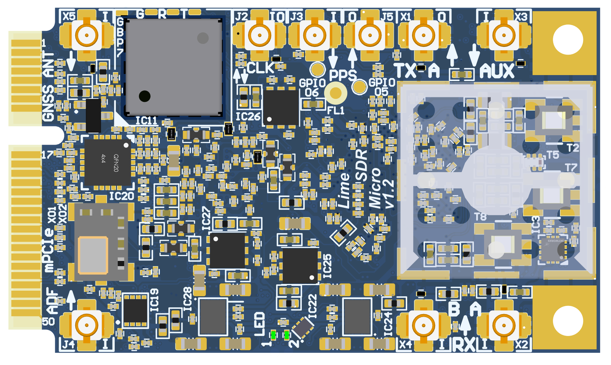

      Figure 1 LimeSDR Micro v1.2 top

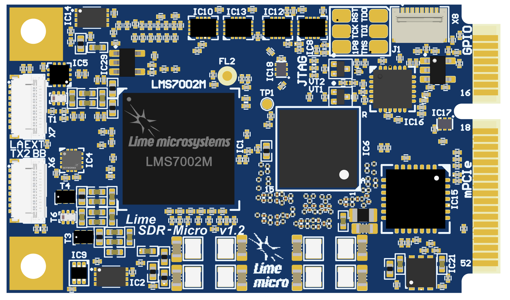

      Figure 2 LimeSDR Micro v1.2 bottom

LimeSDR Micro M.2 board features:

* RF and BB parameters:

  * Configuration: MISO (1xTX, 2xRX)
  * Frequency range: 30 MHz – 3.8 GHz
  * Bandwidth: 30.72 MHz
  * Sample depth: 12 bit
  * Sample rate: 30.72 MSPS
  * Transmit power: max 10 dBm (depending on frequency)

* Baseband processor: board is designed based on NXP Semiconductors LA9310X7S11AA BB processor in 157-ball LFBGA package. NXP Semiconductors LA9310X7S11AA features are:

  * 157-pin LFBGA package (8mm x 8mm, 1.25mm)
  * Core type Arm Cortex-M4.
  * 307 MHz Operating frequency 
  * Integrated ADC/DAC (160 MSPS)
  * 66 kB SRAM
  * Configuration via JTAG

* RF transceiver: Lime Microsystems LMS7002M

* EEPROM Memory: 128Kb EEPROM for LMS MCU firmware (optional); 512Kb EEPROM for BB processor data (optional)

* Temperature sensor: TMP1075NDRLR

* General user inputs/outputs:

  * 2x Green LEDs
  * 4x GPIOs 3.3V in RFCTL/GPIO connector

* Connections:

  * Coaxial RF (U.FL female) connectors
  * BB processor JTAG connector (unpopulated)
  * Mini PCIe edge connector
  * RF Baseband 15-pin FPC connectors

* Clock system:

  * 30.72 MHz on board VCTCXO
  * VCTCXO may be tuned by on board DAC
  * Reference clock input and output connectors (U.FL and mPCIe)

* Board size: 50.8mm x 29.7mm (PCIe Mini card form factor)

* Board power sources: mPCIe (3.3V)

For more information on the following topics, refer to the respective documents:

* `Lime Microsystems LMS7002M transceiver resources <https://limemicro.com/technology/lms7002m/>`_
* `NXP Semiconductors LA9310X7S11AA base band processor resources <https://www.nxp.com/part/LA9310X7S11AA>`_

Board Overview
**************

One of the key elements of LimeSDR Micro board is Semiconductors LA9310X7S11AA base band processor. 
It’s main function is to transfer digital data between LMS7002M RF transceiver and PC through a mPCIe edge connector. 
The block diagram for LimeSDR Micro board is presented in the Figure 3.

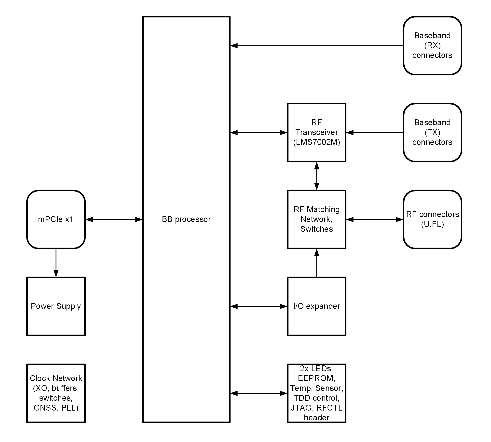
  
  Figure 3 LimeSDR Micro v1.2 board block diagram

This section contains component location description on the board. 
LimeSDR XTRX board picture with highlighted connectors and main components are presented in Figure 4 and Figure 5, respectively. 

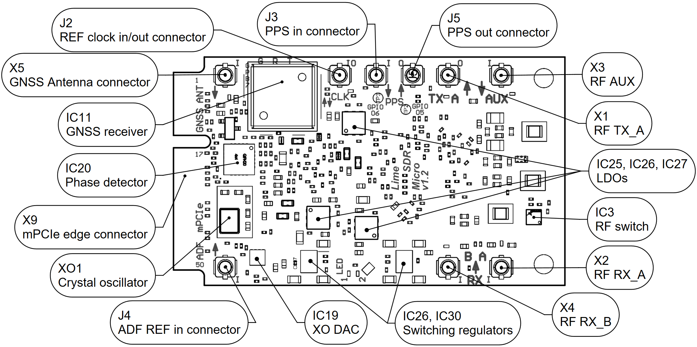
  
  Figure 4 LimeSDR Micro v1.2 board top connectors and main components

.. _target3:

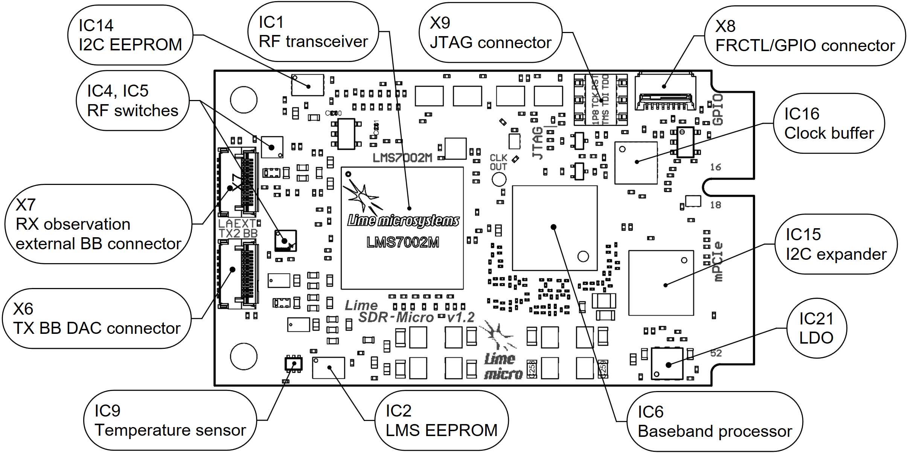
  
  Figure 5 LimeSDR Micro v1.2 board bottom connectors and main components

Description of board components is given in the Table 1.

.. table:: Table 1. Board components

  +-----------------------------------------------------------------------------------------------------------------------------------------------+
  | **Featured Devices**                                                                                                                          |
  +==========================+================+===================================================================================================+
  | **Board   Reference**    | **Type**       | **Description**                                                                                   |
  +--------------------------+----------------+---------------------------------------------------------------------------------------------------+
  | IC1                      | RF transceiver | Lime Microsystems LMS7002M                                                                        |
  +--------------------------+----------------+---------------------------------------------------------------------------------------------------+
  | IC6                      | BB processor   | NXP Semiconductors LA9310X7S11AA                                                                  |
  +--------------------------+----------------+---------------------------------------------------------------------------------------------------+
  | **Miscellaneous devices**                                                                                                                     |
  +--------------------------+----------------+---------------------------------------------------------------------------------------------------+
  | IC9                      | IC             | Temperature sensor TMP1075NDRLR                                                                   |
  +--------------------------+----------------+---------------------------------------------------------------------------------------------------+
  | IC15                     | IC             | I2C I/O expander MCP23017-E/ML                                                                    |
  +--------------------------+----------------+---------------------------------------------------------------------------------------------------+
  | **Configuration, Status and Setup Elements**                                                                                                  |
  +--------------------------+----------------+---------------------------------------------------------------------------------------------------+
  | J1                       | JTAG   header  | FPGA   programming connector on the PCB bottom side (compatible with Molex 788641001   connector) |
  +--------------------------+----------------+---------------------------------------------------------------------------------------------------+
  | X8                       | FPC connector  | FRCTL/GPIO connector                                                                              |
  +--------------------------+----------------+---------------------------------------------------------------------------------------------------+
  | LED1,   LED2             | Status LEDs    | User defined BB processor   indication green LEDs                                                 |
  +--------------------------+----------------+---------------------------------------------------------------------------------------------------+
  | **RF Circuitry**                                                                                                                              |
  +--------------------------+----------------+---------------------------------------------------------------------------------------------------+
  | IC5                      | IC             | SPDT RF switch                                                                                    |
  +--------------------------+----------------+---------------------------------------------------------------------------------------------------+
  | IC3, IC4                 | IC             | SP4T RF switch                                                                                    |
  +--------------------------+----------------+---------------------------------------------------------------------------------------------------+
  | X1, X2,   X3, X4         | U.FL connector | RF connectors                                                                                     |
  +--------------------------+----------------+---------------------------------------------------------------------------------------------------+
  | X6                       |  FPC connector | LMS7002 base band TX DAC BB   15-pin FPC connector                                                |
  +--------------------------+----------------+---------------------------------------------------------------------------------------------------+
  | X7                       |  FPC connector | RX obeservation external BB   15-pin FPC connector                                                |
  +--------------------------+----------------+---------------------------------------------------------------------------------------------------+
  | **Memory Devices**                                                                                                                            |
  +--------------------------+----------------+---------------------------------------------------------------------------------------------------+
  | IC2                      | IC             | I²C EEPROM Memory 128Kb (16K x   8), connected to LMS7002M RF transceiver I2C bus                 |
  +--------------------------+----------------+---------------------------------------------------------------------------------------------------+
  | IC14                     | IC             | I²C EEPROM Memory 512Kb (64K x   8), connected to BB processor I2C bus                            |
  +--------------------------+----------------+---------------------------------------------------------------------------------------------------+
  | **Communication Ports**                                                                                                                       |
  +--------------------------+----------------+---------------------------------------------------------------------------------------------------+
  | X9                       | mPCIe          | Mini PCIe Edge connector                                                                          |
  +--------------------------+----------------+---------------------------------------------------------------------------------------------------+
  | **Clock Circuitry**                                                                                                                           |
  +--------------------------+----------------+---------------------------------------------------------------------------------------------------+
  | XO1                      | VCTCXO         | 30.72 MHz Voltage Controlled   Temperature Compensated Crystal Oscillator                         |
  +--------------------------+----------------+---------------------------------------------------------------------------------------------------+
  | IC20                     | IC             | ADF4002 phase detector                                                                            |
  +--------------------------+----------------+---------------------------------------------------------------------------------------------------+
  | IC16                     | IC             | LMK00105 clock buffer                                                                             |
  +--------------------------+----------------+---------------------------------------------------------------------------------------------------+
  | IC19                     | IC             | 16 bit DAC for VCTCXO (XO1)   frequency tuning (default)                                          |
  +--------------------------+----------------+---------------------------------------------------------------------------------------------------+
  | IC11                     | IC             | M10578-A3 GNSS Receiver module                                                                    |
  +--------------------------+----------------+---------------------------------------------------------------------------------------------------+
  | IC17,   IC18             | IC             | Analogue switches                                                                                 |
  +--------------------------+----------------+---------------------------------------------------------------------------------------------------+
  | J4                       | U.FL connector | Phase detector reference clock   input                                                            |
  +--------------------------+----------------+---------------------------------------------------------------------------------------------------+
  | J2                       | U.FL connector | Reference clock output/output                                                                     |
  +--------------------------+----------------+---------------------------------------------------------------------------------------------------+
  | J3                       | U.FL connector | 1PPS input                                                                                        |
  +--------------------------+----------------+---------------------------------------------------------------------------------------------------+
  | J5                       | U.FL connector | 1PPS output                                                                                       |
  +--------------------------+----------------+---------------------------------------------------------------------------------------------------+
  | X5                       | U.FL connector | GNSS (active) antenna connector                                                                   |
  +--------------------------+----------------+---------------------------------------------------------------------------------------------------+
  | **Power Supply**                                                                                                                              |
  +--------------------------+----------------+---------------------------------------------------------------------------------------------------+
  | IC24,   IC28             | IC             | Four-output switching regulator   LP8758A1E0YFFR                                                  |
  +--------------------------+----------------+---------------------------------------------------------------------------------------------------+
  | IC21,   IC25, IC26, IC27 | IC             | Linear regulator LD39100PUR                                                                       |
  +--------------------------+----------------+---------------------------------------------------------------------------------------------------+
  | IC29                     | IC             | Linear regulator AP7330                                                                           |
  +--------------------------+----------------+---------------------------------------------------------------------------------------------------+

LimeSDR Micro Board Architecture
********************************

More detailed description of LimeSDR Micro board components and interconnections is given in the following sections of this chapter.

LMS7002M RF transceiver digital connectivity
============================================

The interface and control signals are described below:

* Baseband Signals: LMS7002 is using baseband signals (I and Q) to transfer data to/from the NXP Baseband processor:

  * TX signals LMS_TX1_BB_I/Q_P/N where I/Q indicates in-phase and quadrature signals and P/N indicates differential positive and negative pairs. 
  * RX signals LMS_RX1/2_BB_I/Q_P/N where RX1/2 indicates RF channel 1 or 2, I/Q indicates I and Q signals and P/N indicates differential positive and negative pairs. 
* LMS Control Signals: these signals are used for the following functions within the LMS7002 RFIC:

  * LMS_RXEN, LMS_TXEN – receiver and transmitter enable/disable signals connected to FPGA Bank 14 (3.3V).
  * LMS_RESET – LMS7002M reset is connected to FPGA Bank 14 (3.3V).
* SPI Interface: LMS7002M transceiver is configured via 4-wire SPI interface: LA_SPI_SCLK, LA_SPI_MOSI, LA_SPI_MISO, LA_SPI_LMS_SS. The SPI interface is connected to BB processor via level converter IC8.
* LMS I2C Interface: can be used for LMS EEPROM content modification or debug purposes. The signals LMS_I2C_SCL and LMS_I2C_DATA are connected to EEPROM. They can be also connected to BB processors LA_I2C_SCL and LA_I2C_SDA.

All signals connected to LMS7002 are listed in table 2.

.. table:: Table 2. LMS7002M RF transceiver signals

    +----------------------+----------------------------+-----------------------------+-----------------------+--------------------------+----------------------------------------------+
    | **Chip   pin (IC1)** | **Chip   reference (IC1)** | **Schematic   signal name** |                       |                          | **Comment**                                  |
    |                      |                            |                             |      **BB processor** |      **BB processor**    |                                              |
    |                      |                            |                             |                       |                          |                                              |
    |                      |                            |                             |      **pin (IC6)**    |      **reference (IC6)** |                                              |
    +======================+============================+=============================+=======================+==========================+==============================================+
    | AB34                 | MCLK1                      | LMS_MCLK1                   | F1                    | DCS_CLK_P                | DCS_CLK_P                                    |
    |                      |                            |                             +-----------------------+--------------------------+----------------------------------------------+
    |                      |                            |                             | F2                    | DCS_CLK_N                | DCS_CLK_N                                    |
    +----------------------+----------------------------+-----------------------------+-----------------------+--------------------------+----------------------------------------------+
    | D28                  | SEN                        | LA_SPI_LMS_SS               | P7                    | SPI_CS0_B                | SPI   signals connected via level translator |
    +----------------------+----------------------------+-----------------------------+-----------------------+--------------------------+                                              |
    | C29                  | SCLK                       | LA_SPI_SCLK                 | P8                    | SPI_CLK                  |                                              |
    +----------------------+----------------------------+-----------------------------+-----------------------+--------------------------+                                              |
    | F30                  | SDIO                       | LA_SPI_MOSI                 | R9                    | SPI_MOSI                 |                                              |
    +----------------------+----------------------------+-----------------------------+-----------------------+--------------------------+                                              |
    | F28                  | SDO                        | LA_SPI_MISO                 | P8                    | SPI_MISO                 |                                              |
    +----------------------+----------------------------+-----------------------------+-----------------------+--------------------------+----------------------------------------------+
    | D26                  | SDA                        | LMS_I2C_SDA                 | P6   (NC)             | IIC1_SDA                 |                                              |
    |                      |                            |                             |                       |                          |      BB processor and LMS7002M I2C signals   |
    +----------------------+----------------------------+-----------------------------+-----------------------+--------------------------+                                              |
    | C27                  | SCL                        | LMS_I2C_SCL                 | R6   (NC)             | IIC1_SCL                 |      are not connected by default            |
    +----------------------+----------------------------+-----------------------------+-----------------------+--------------------------+----------------------------------------------+
    | T4                   | tbbip_pad_1                | LMS_TX1_BB_I_P              | A7                    | TX_I_P                   | RF   channel 1 TX baseband I data            |
    +----------------------+----------------------------+-----------------------------+-----------------------+--------------------------+                                              |
    | R5                   | tbbin_pad_1                | LMS_TX1_BB_I_N              | B7                    | TX_I_N                   |                                              |
    +----------------------+----------------------------+-----------------------------+-----------------------+--------------------------+----------------------------------------------+
    | R3                   | tbbqp_pad_1                | LMS_TX1_BB_Q_P              | A9                    | TX_Q_P                   | RF   channel 1 TX baseband Q data            |
    +----------------------+----------------------------+-----------------------------+-----------------------+--------------------------+                                              |
    | P2                   | tbbqn_pad_1                | LMS_TX1_BB_Q_N              | B9                    | TX_Q_N                   |                                              |
    +----------------------+----------------------------+-----------------------------+-----------------------+--------------------------+----------------------------------------------+
    | V2                   | tbbip_pad_2                | LMS_TX2_BB_I_P              |                       |                          | Connected toX6 pin 2 (RF2 TX NC)             |
    +----------------------+----------------------------+-----------------------------+-----------------------+--------------------------+----------------------------------------------+
    | T6                   | tbbin_pad_2                | LMS_TX2_BB_I_N              |                       |                          | Connected to X6 pin 3 (RF2 TX NC)            |
    +----------------------+----------------------------+-----------------------------+-----------------------+--------------------------+----------------------------------------------+
    | U3                   | tbbqp_pad_2                | LMS_TX2_BB_Q_P              |                       |                          | Connected to X6 pin 5 (RF2 TX NC)            |
    +----------------------+----------------------------+-----------------------------+-----------------------+--------------------------+----------------------------------------------+
    | U1                   | tbbqn_pad_2                | LMS_TX2_BB_Q_N              |                       |                          | Connected to X6 pin 6 (RF2 TX NC)            |
    +----------------------+----------------------------+-----------------------------+-----------------------+--------------------------+----------------------------------------------+
    | Y6                   | rbbip_pad_1                | LMS_RX1_BB_I_P              | B4                    | RX0_I_P                  | RF   channel 1 RX baseband I data            |
    +----------------------+----------------------------+-----------------------------+-----------------------+--------------------------+                                              |
    | AB2                  | rbbin_pad_1                | LMS_RX1_BB_I_N              | A4                    | RX0_I_N                  |                                              |
    +----------------------+----------------------------+-----------------------------+-----------------------+--------------------------+----------------------------------------------+
    | AB4                  | rbbqp_pad_1                | LMS_RX1_BB_Q_P              | A6                    | RX0_Q_P                  | RF   channel 1 RX baseband Q data            |
    +----------------------+----------------------------+-----------------------------+-----------------------+--------------------------+                                              |
    | AA5                  | rbbqn_pad_1                | LMS_RX1_BB_Q_N              | B6                    | RX0_Q_N                  |                                              |
    +----------------------+----------------------------+-----------------------------+-----------------------+--------------------------+----------------------------------------------+
    | AD2                  | rbbip_pad_2                | LMS_RX2_BB_I_P              | A10                   | RX1_I_P                  | RF   channel 2 RX baseband I data            |
    +----------------------+----------------------------+-----------------------------+-----------------------+--------------------------+                                              |
    | AC3                  | rbbin_pad_2                | LMS_RX2_BB_I_N              | B10                   | RX1_I_N                  |                                              |
    +----------------------+----------------------------+-----------------------------+-----------------------+--------------------------+----------------------------------------------+
    | AC5                  | rbbqp_pad_2                | LMS_RX2_BB_Q_P              | B12                   | RX1_Q_P                  | RF   channel 2 RX baseband Q data            |
    +----------------------+----------------------------+-----------------------------+-----------------------+--------------------------+                                              |
    | AB6                  | rbbqn_pad_2                | LMS_RX2_BB_Q_N              | A12                   | RX1_Q_N                  |                                              |
    +----------------------+----------------------------+-----------------------------+-----------------------+--------------------------+----------------------------------------------+
    | E5                   | xoscin_tx                  | LMS_TX_CLK                  |                       |                          | Connected to 30.72 MHz clock                 |
    +----------------------+----------------------------+-----------------------------+-----------------------+--------------------------+----------------------------------------------+
    | AM24                 | xoscin_rx                  | LMS_RxPLL_CLK               |                       |                          | Connected to 30.72 MHz clock                 |
    +----------------------+----------------------------+-----------------------------+-----------------------+--------------------------+----------------------------------------------+
    | E27                  | RESET                      | LMS_RESET                   |                       |                          | I/O expander GPA0                            |
    +----------------------+----------------------------+-----------------------------+-----------------------+--------------------------+----------------------------------------------+
    | U29                  | TXEN                       | LMS_TXEN                    |                       |                          | Pulled-up by R11                             |
    +----------------------+----------------------------+-----------------------------+-----------------------+--------------------------+----------------------------------------------+
    | V34                  | RXEN                       | LMS_RXEN                    |                       |                          | Pulled-up by R12                             |
    +----------------------+----------------------------+-----------------------------+-----------------------+--------------------------+----------------------------------------------+
    | U33                  | CORE_LDO_EN                | LMS_CORE_LDO_EN             |                       |                          | Pulled-up by R13                             |
    +----------------------+----------------------------+-----------------------------+-----------------------+--------------------------+----------------------------------------------+
    | V30                  | LOGIC_RESET                |                             |                       |                          | GND                                          |
    +----------------------+----------------------------+-----------------------------+-----------------------+--------------------------+----------------------------------------------+

LMS7002M baseband connectors
============================

Baseband signals can be accessed 
via 0.3mm pitch 15 pin FPC connectors (X6 and X7). NXP base band processors RX observation external connector pinout is shown in Table 3. 
LMS7002M TX DAC connector pinout is shown in Table 4.

.. table:: Table 3. Basedand processors RX obeservation external BB 15-pin FPC connector (X7)

    +---------+-----------------------------+-----------------------------------------------------+
    | **Pin** | **Schematic signal   name** | **Description**                                     |
    +=========+=============================+=====================================================+
    | 1       | GND                         | Ground                                              |
    +---------+-----------------------------+-----------------------------------------------------+
    | 2       | LA_RO0_EXT_I_P              | Channel 1 in-phase   signal differential positive   |
    +---------+-----------------------------+-----------------------------------------------------+
    | 3       | LA_RO0_EXT_I_N              | Channel 1 in-phase   signal differential negative   |
    +---------+-----------------------------+-----------------------------------------------------+
    | 4       | GND                         | Ground                                              |
    +---------+-----------------------------+-----------------------------------------------------+
    | 5       | LA_RO0_EXT_Q_P              | Channel 1 quadrature   signal differential positive |
    +---------+-----------------------------+-----------------------------------------------------+
    | 6       | LA_RO0_EXT_Q_N              | Channel 1 quadrature   signal differential negative |
    +---------+-----------------------------+-----------------------------------------------------+
    | 7       | GND                         | Ground                                              |
    +---------+-----------------------------+-----------------------------------------------------+
    | 8       | VCC3P3                      | Power (3.3 V)                                       |
    +---------+-----------------------------+-----------------------------------------------------+
    | 9       | GND                         | Ground                                              |
    +---------+-----------------------------+-----------------------------------------------------+
    | 10      | LA_RO1_EXT_I_P              | Channel 2 in-phase   signal differential positive   |
    +---------+-----------------------------+-----------------------------------------------------+
    | 11      | LA_RO1_EXT_I_N              | Channel 2 in-phase   signal differential negative   |
    +---------+-----------------------------+-----------------------------------------------------+
    | 12      | GND                         | Ground                                              |
    +---------+-----------------------------+-----------------------------------------------------+
    | 13      | LA_RO1_EXT_Q_P              | Channel 2 quadrature   signal differential positive |
    +---------+-----------------------------+-----------------------------------------------------+
    | 14      | LA_RO1_EXT_Q_N              | Channel 2 quadrature   signal differential negative |
    +---------+-----------------------------+-----------------------------------------------------+
    | 15      | GND                         | Ground                                              |
    +---------+-----------------------------+-----------------------------------------------------+

.. table:: Table 4. LMS7002 base band TX DAC BB 15-pin FPC connector (X6)

    +---------+-----------------------------+-----------------------------------------------------+
    | **Pin** | **Schematic signal   name** | **Description**                                     |
    +=========+=============================+=====================================================+
    | 1       | GND                         | Ground                                              |
    +---------+-----------------------------+-----------------------------------------------------+
    | 2       | LMS_TX2_BB_I_P              | Channel 1 in-phase   signal differential positive   |
    +---------+-----------------------------+-----------------------------------------------------+
    | 3       | LMS_TX2_BB_I_N              | Channel 1 in-phase   signal differential negative   |
    +---------+-----------------------------+-----------------------------------------------------+
    | 4       | GND                         | Ground                                              |
    +---------+-----------------------------+-----------------------------------------------------+
    | 5       | LMS_TX2_BB_Q_P              | Channel 1 quadrature   signal differential positive |
    +---------+-----------------------------+-----------------------------------------------------+
    | 6       | LMS_TX2_BB_Q_N              | Channel 1 quadrature   signal differential negative |
    +---------+-----------------------------+-----------------------------------------------------+
    | 7       | GND                         | Ground                                              |
    +---------+-----------------------------+-----------------------------------------------------+
    | 8       | VCC3P3                      | Power (3.3 V)                                       |
    +---------+-----------------------------+-----------------------------------------------------+
    | 9       | GND                         | Ground                                              |
    +---------+-----------------------------+-----------------------------------------------------+
    | 10      | NC                          | No connection                                       |
    +---------+-----------------------------+-----------------------------------------------------+
    | 11      | NC                          | No connection                                       |
    +---------+-----------------------------+-----------------------------------------------------+
    | 12      | GND                         | Ground                                              |
    +---------+-----------------------------+-----------------------------------------------------+
    | 13      | NC                          | No connection                                       |
    +---------+-----------------------------+-----------------------------------------------------+
    | 14      | NC                          | No connection                                       |
    +---------+-----------------------------+-----------------------------------------------------+
    | 15      | GND                         | Ground                                              |
    +---------+-----------------------------+-----------------------------------------------------+

RF network control signals
==========================

LimeSDR Micro RF network contains matching networks, RF switches and U.FL connectors 
(X1 - TX and X2, X4 - RX) as shown in Figure 6.

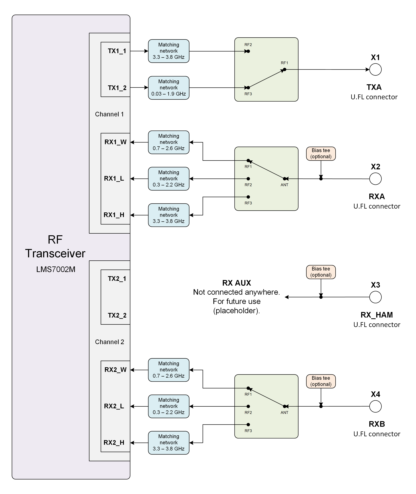
  
  Figure 6 LimeSDR Micro v1.2 RF diagram

LMS7002M RF transceiver TX and RX ports has dedicated matching network which determines the 
working frequency range. More detailed information on LMS7002M RF transceiver ports and matching 
network frequency ranges is listed in the Table 5.

.. table:: Table 5. LMS7002M RF transceiver ports and matching networks frequency ranges

    +----------------------------------+---------------------+
    | **LMS7002M RF transceiver port** | **Frequency range** |
    +==================================+=====================+
    | TX1_1                            | 3.3 GHz - 3.8 GHz   |
    +----------------------------------+---------------------+
    | TX1_2                            | 0.03 GHz - 1.9 GHz  |
    +----------------------------------+---------------------+
    | RX1_H,   RX2_H                   | 3.3 GHz - 3.8 GHz   |
    +----------------------------------+---------------------+
    | RX1_W,   RX2_W                   | 0.7 GHz - 2.6 GHz   |
    +----------------------------------+---------------------+
    | RX1_L,   RX2_L                   | 0.3 MHz - 2.2 GHz   |
    +----------------------------------+---------------------+

RF network switches are controlled via 2.4V logic signals. 
This is achieved by resistor dividers connected between I2C GPIO expander (TX_SW, RX_SW2, RX_SW3) and switch 
control pin (TX_SW_DIV, RX_SW2_DIV, RX_S3_DIV). RF network control signals are described in the Table 6.

.. table:: Table 6. RF network control signals

    +-----------------------------+-----------------------------+------------------+----------------------------+--------------------------------------------------------+
    | **Component**               | **Schematic signal   name** | **I/O standard** | **I2C I/O expander   pin** | **Description**                                        |
    +=============================+=============================+==================+============================+========================================================+
    | SKY13330-397LF(IC5)         | TX_SW/TX_SW_DIV             | 3.3V             | GPB1                       | 3.3V logic level   signal divided to 2.4V logic level. |
    +-----------------------------+-----------------------------+------------------+----------------------------+--------------------------------------------------------+
    | SKY13414-485LF(IC3 and IC4) | RX_SW2/RX_SW2_DIV           | 3.3V             | GPB0                       | 3.3V logic level   signal divided to 2.4V logic level. |
    |                             +-----------------------------+------------------+----------------------------+--------------------------------------------------------+
    |                             | RX_SW3/RX_SW3_DIV           | 3.3V             | GPB2                       | 3.3V logic level   signal divided to 2.4V logic level. |
    +-----------------------------+-----------------------------+------------------+----------------------------+--------------------------------------------------------+

Indication LEDs
===============

LimeSDR Micro board comes with two green indicator LEDs. These LEDs are soldered on the top of the board near rigth edge. 

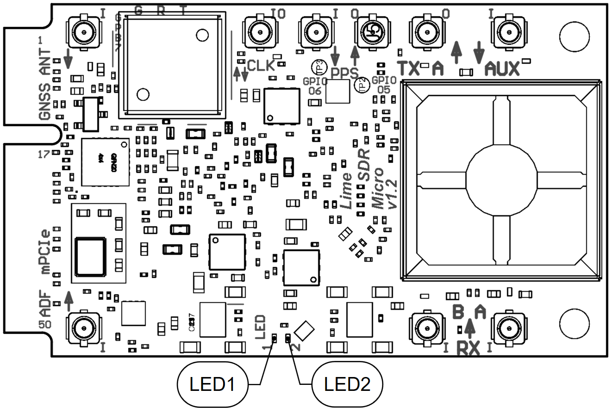
  
  Figure 7 LimeSDR Micro v1.2 indication LEDs (top)

LEDs are connected to baseband processors GPIOs hence their function may be programmed according to the user requirements. 
Default LEDs configuration and description are shown in Table 7.

.. table:: Table 7. Default LEDs configuration

    +-----------------------+--------------------+-----------------+----------------------+-----------------+
    | **Board   Reference** | **Schematic name** | **Board label** | **BB processor pin** | **Description** |
    +=======================+====================+=================+======================+=================+
    | LED1                  | LA_LED1            | LED1            | R11 (GPIO_17)        | User defined    |
    +-----------------------+--------------------+-----------------+----------------------+-----------------+
    | LED2                  | LA_LED2            | LED2            | P12 (GPIO_18)        | User defined    |
    +-----------------------+--------------------+-----------------+----------------------+-----------------+

Low speed interfaces
====================

Baseband processors SPI (LA_SPI) pins, schematic signal names and I/O standards/levels are shown in Table 8.

.. table:: Table 8. LA_SPI interface pins

  +-----------------------------+----------------------+------------------+---------------------------------------------+
  | **Schematic   signal name** | **BB processor pin** | **I/O standard** | **Comment**                                 |
  +=============================+======================+==================+=============================================+
  | LA_SPI_SCLK                 | P8                   | 3.3V             | Serial Clock (LA output)                    |
  +-----------------------------+----------------------+------------------+---------------------------------------------+
  | LA_SPI_MOSI                 | R9                   | 3.3V             | Data (LA output)                            |
  +-----------------------------+----------------------+------------------+---------------------------------------------+
  | LA_SPI_MISO                 | R8                   | 3.3V             | Data (LA input)                             |
  +-----------------------------+----------------------+------------------+---------------------------------------------+
  | LA_SPI_LMS_SS               | P7                   | 3.3V             | IC1 (LMS7002) SPI slave select (LA output)  |
  +-----------------------------+----------------------+------------------+---------------------------------------------+
  | LA_SPI_ADF_SS               | P11                  | 3.3V             | IC20 (ADF4002) SPI slave select (LA output) |
  +-----------------------------+----------------------+------------------+---------------------------------------------+

Baseband processors I2C (LA_I2C)  
interface slave devices (temperature sensor, EEPROM, I/O expander, CLK DAC and switching regulators) and related information are given in Table 9.

.. table:: Table 9. LA_I2C interfaces pins

  +------------------------+---------------------+--------------------------------------+
  | **I2C   slave device** | **Slave device**    | **I2C address**                      |
  +========================+=====================+======================================+
  | IC10                   | Temperature sensor  | 1 0 0 1 0 1 1 RW                     |
  +------------------------+---------------------+--------------------------------------+
  | IC13                   | EEPROM              | 1 0 1 0 0 0 0 RW                     |
  +------------------------+---------------------+--------------------------------------+
  | IC14                   | I/O expander        | 0 1 0 0 0 0 0 RW                     |
  +------------------------+---------------------+--------------------------------------+
  | IC18                   | XO DAC              | 1 0 0 1 1 0 0 RW                     |
  +------------------------+---------------------+--------------------------------------+
  | IC25                   | Switching regulator | 1 1 0 0 0 0 0 RW (I2C_SDA_SEL =   0) |
  +------------------------+---------------------+--------------------------------------+
  | IC29                   | Switching regulator | 1 1 0 0 0 0 0 RW (I2C_SDA_SEL =   1) |
  +------------------------+---------------------+--------------------------------------+

Switching regulators (IC25 and IC29) share identical I2C address, switching between them 
is done by I2C_SDA_SEL signal connected to I2C I/O expanders GPB3.

To debug Baseband processors JTAG J1 connector is used. It is located on the PCB bottom side (see :ref:`target3`) and is 
compatible with Molex 788641001 connector. 
JTAG connector pins, schematic signal names, FPGA interconnections and I/O standards are listed in Table 10.

.. table:: Table 10. JTAG connector J1 pins

  +---------------------+---------------------------+----------------------+------------------+------------------+
  | **Connector   pin** | **Schematic signal name** | **BB processor pin** | **I/O standard** | **Comment**      |
  +=====================+===========================+======================+==================+==================+
  | 1                   | LA_TDO                    | N12                  | 1.8V             | Test Data Output |
  +---------------------+---------------------------+----------------------+------------------+------------------+
  | 2                   | LA_TDI                    | M10                  | 1.8V             | Test Data Input  |
  +---------------------+---------------------------+----------------------+------------------+------------------+
  | 3                   | LA_TMS                    | M12                  | 1.8V             | Test Mode Select |
  +---------------------+---------------------------+----------------------+------------------+------------------+
  | 4                   | VCC1P8                    |                      |                  | Power (1.8V)     |
  +---------------------+---------------------------+----------------------+------------------+------------------+
  | 5                   | LA_TCK                    | N10                  | 1.8V             | Test Clock       |
  +---------------------+---------------------------+----------------------+------------------+------------------+
  | 6                   | JTAG_RST                  | N8                   | 1.8V             | Reset            |
  +---------------------+---------------------------+----------------------+------------------+------------------+

GPIO connectors
===============

Three base band processors RF control/GPIOs and one I2C GPIO expander pin are connected 
to 8 pin FPC connector (X8). Additionaly one pin is dedicated for power (3.3V) and every other pin 
is ground as shown in table 11.  

.. table:: Table 11. RFCTL/ GPIOs connector (X8) pins

  +---------------------+---------------------------+----------------------+------------------+-------------------+
  | **Connector   pin** | **Schematic signal name** | **BB processor pin** | **I/O standard** | **Comment**       |
  +=====================+===========================+======================+==================+===================+
  | 1                   | VCC3P3                    |                      | 3.3V             | Power (3.3V)      |
  +---------------------+---------------------------+----------------------+------------------+-------------------+
  | 2                   | TDD0_GPIO                 | M14                  | 3.3V             | TXRX0/GPIO7       |
  +---------------------+---------------------------+----------------------+------------------+-------------------+
  | 3                   | GND                       |                      | 3.3V             | Ground            |
  +---------------------+---------------------------+----------------------+------------------+-------------------+
  | 4                   | TDD1_GPIO                 | P14                  | 3.3V             | PA_EN/GPIO12      |
  +---------------------+---------------------------+----------------------+------------------+-------------------+
  | 5                   | GND                       |                      | 3.3V             | Ground            |
  +---------------------+---------------------------+----------------------+------------------+-------------------+
  | 6                   | LNA1_EN                   | M15                  | 3.3V             | LNA1_EN/GPIO11    |
  +---------------------+---------------------------+----------------------+------------------+-------------------+
  | 7                   | GND                       |                      | 3.3V             | Ground            |
  +---------------------+---------------------------+----------------------+------------------+-------------------+
  | 8                   | EXP_GPB7                  | GPIO EXP (GPB7)      | 3.3V             | I2C GPIO expander |
  +---------------------+---------------------------+----------------------+------------------+-------------------+

Clock Distribution
==================

LimeSDR Micro board clock distribution block diagram is as shown in Figure 8.

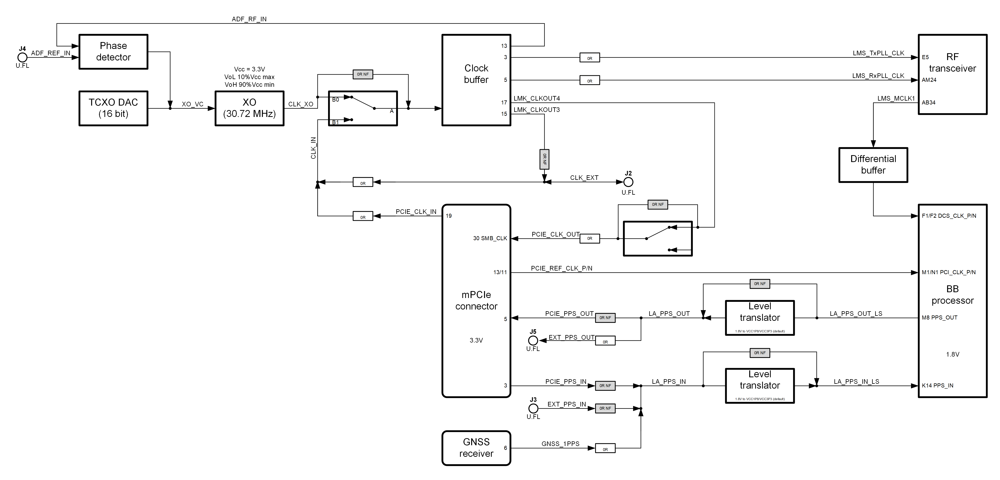
  
  Figure 8 LimeSDR Micro v1.2 board clock distribution block diagram

LimeSDR XTRX board features an on board 30.72 MHz VCTCXO as the reference clock for 
LMS7002M RF transceiver.

Rakon E6245LF 30.72 MHz voltage controlled temperature compensated crystal oscillator (VCTCXO) 
is the clock source for the board. VCTCXO frequency may be tuned by using 16 bit DAC (IC19). 
Main VCTCXO parameters are listed in Table 12.

.. table:: Table 12. Rakon E6245LF VCTCXO main parameters

    +------------------------------------+---------------+
    | **Frequency   parameter**          | **Value**     |
    +====================================+===============+
    | Calibration   (25°C ± 1°C)         | ± 1 ppm max   |
    +------------------------------------+---------------+
    | Stability   (-40 to 85 °C)         | ± 50 ppb max  |
    +------------------------------------+---------------+
    | Long term   stability (first year) | ± 1.5 ppm max |
    +------------------------------------+---------------+
    | Control   voltage range            | 0.5V .. 2.5V  |
    +------------------------------------+---------------+
    | Frequency   tuning                 | ± 5 ppm       |
    +------------------------------------+---------------+
    | Slope                              | +7.5 ppm/V    |
    +------------------------------------+---------------+

Analogue switch (IC17) gives option to select clock source for clock buffered from 
onboard VCTCXO clock XO1 (CLK_XO) and external U.FL (J2)/mPCIe (X9) sources (CLK_IN). Buffered clock signal 
(LMK_CLKOUT1 and LMK_CLKOUT4) can also be fed to other board using U.FL (J2)/mPCIe (X9) connectors.

The board clock lines and other related signals/information are listed in Table 13.

.. table:: Table 13. LimeSDR Micro main clock lines

  +------------------------+---------------------------+------------------+-----------------------------------------------------+
  | **Source**             | **Schematic signal name** | **I/O standard** | **Description**                                     |
  +========================+===========================+==================+=====================================================+
  | External   (J2)        | CLK_EXT                   | 3.3V             | External reference clock   input/ouput (U.FL)       |
  +------------------------+---------------------------+------------------+-----------------------------------------------------+
  |                        | LMK_CLKOUT3               | 3.3V             | Reference clock output (U.FL)                       |
  |                        +---------------------------+------------------+-----------------------------------------------------+
  |                        | LMK_CLKOUT4               | 3.3V             | Reference clock output (mPCIe)                      |
  |                        +---------------------------+------------------+-----------------------------------------------------+
  | Clock buffer (IC15)    | LMS_TxPLL_CLK             | 1.8V             | Reference clock connected to LMS   (TX)             |
  |                        +---------------------------+------------------+-----------------------------------------------------+
  |                        | LMS_RxPLL_CLK             | 1.8V             | Reference clock connected to LMS   (RX)             |
  |                        +---------------------------+------------------+-----------------------------------------------------+
  |                        | ADF_RF_IN                 | 3.3V             | Reference clock connected to ADF   (phase detector) |
  +------------------------+---------------------------+------------------+-----------------------------------------------------+
  | VCTCXO   (XO1)         | CLK_XO                    | 3.3V             | Onboard reference clock                             |
  +------------------------+---------------------------+------------------+-----------------------------------------------------+
  |                        | PCIE_REF_CLK_P            |                  |                                                     |
  | External (mPCIe)       +---------------------------+ 1.8V (diff)      | PCIe reference clock                                |
  |                        | PCIE_REF_CLK_N            |                  |                                                     |
  +------------------------+---------------------------+------------------+-----------------------------------------------------+
  | RF   tranceiver (IC1)  | LMS_MCLK1                 | 3.3V             | Reference clock connected to BB   processor         |
  +------------------------+---------------------------+------------------+-----------------------------------------------------+
  | GNSS   Receiver (IC11) | GNSS_1PPS                 | 3.3V             | PPS output from GNSS receiver   for BB processor    |
  +------------------------+---------------------------+------------------+-----------------------------------------------------+
  | External  (J3)         | EXT_PPS_IN                | 3.3V             | External PPS input (U.FL)                           |
  +------------------------+---------------------------+------------------+-----------------------------------------------------+
  | External   (MPCIe)     | PCIE_PPS_IN               | 3.3V             | External PPS input (mPCIe)                          |
  +------------------------+---------------------------+------------------+-----------------------------------------------------+
  |                        | PCIE_PPS_OUT              | 3.3V             | PPS output (mPCIe)                                  |
  | BB processor (IC6)     +---------------------------+------------------+-----------------------------------------------------+
  |                        | EXT_PPS_OUT               | 3.3V             | PPS output (U.FL J5)                                |
  +------------------------+---------------------------+------------------+-----------------------------------------------------+

Mini PCIe (mPCIe) edge connector
================================

LimeSDR Micro board communicates with the host system via mPCIe edge connector. 
LimeSDR Micro VCC3P3_MPCIE connector pinout and signals according to the specification is given in Table 14.

.. table:: Table 14. Mini PCIe x1 edge connector pinout 

  +---------+----------------------------------+------------------------------------------+------------------------------------------------------------------+
  | **Pin** | **Mini   PCIe x1 Specification** | **LimeSDR XTRX   Schematic Signal Name** | **Description**                                                  |
  +=========+==================================+==========================================+==================================================================+
  | 1       | Wake#                            | NC                                       | Not connected                                                    |
  +---------+----------------------------------+------------------------------------------+------------------------------------------------------------------+
  | 2       | 3.3 Vaux                         | VCC3P3_MPCIE                             | Main power input 3.3V   (VCC3P3_MPCIE)                           |
  +---------+----------------------------------+------------------------------------------+------------------------------------------------------------------+
  | 3       | COEX1                            | PCIE_PPS_IN                              | External 1PPS input                                              |
  +---------+----------------------------------+------------------------------------------+------------------------------------------------------------------+
  | 4       | GND                              | GND                                      | Ground                                                           |
  +---------+----------------------------------+------------------------------------------+------------------------------------------------------------------+
  | 5       | COEX2                            | PCIE_PPS_OUT                             | GPS 1PPS output                                                  |
  +---------+----------------------------------+------------------------------------------+------------------------------------------------------------------+
  | 6       | GND                              | NC                                       | Not connected                                                    |
  +---------+----------------------------------+------------------------------------------+------------------------------------------------------------------+
  | 7       | CLKREQ#                          | CLK_REQUEST#                             | PCIe clock request tied to GND through   resistor 330 Ohm        |
  +---------+----------------------------------+------------------------------------------+------------------------------------------------------------------+
  | 8       | UIM PWR                          | NC                                       | Not connected                                                    |
  +---------+----------------------------------+------------------------------------------+------------------------------------------------------------------+
  | 9       | GND                              | GND                                      | Ground                                                           |
  +---------+----------------------------------+------------------------------------------+------------------------------------------------------------------+
  | 10      | UIM_DATA                         | NC                                       | Not connected                                                    |
  +---------+----------------------------------+------------------------------------------+------------------------------------------------------------------+
  | 11      | REFCLK-                          | PCIE_REF_CLK_N                           | PCI Express Reference   clock differential pair negative signal  |
  +---------+----------------------------------+------------------------------------------+------------------------------------------------------------------+
  | 12      | UIM_CLK                          | NC                                       | Not connected                                                    |
  +---------+----------------------------------+------------------------------------------+------------------------------------------------------------------+
  | 13      | REFCLK+                          | PCIE_REF_CLK_P                           | PCI Express Reference   clock differential pair positive signal  |
  +---------+----------------------------------+------------------------------------------+------------------------------------------------------------------+
  | 14      | UIM_RESET                        | NC                                       | Not connected                                                    |
  +---------+----------------------------------+------------------------------------------+------------------------------------------------------------------+
  | 15      | GND                              | GND                                      | Ground                                                           |
  +---------+----------------------------------+------------------------------------------+------------------------------------------------------------------+
  | 16      | UIM_VPP                          | NC                                       | Not connected                                                    |
  +---------+----------------------------------+------------------------------------------+------------------------------------------------------------------+
  | 17      | Reserved                         | TDD0_GPIO                                | TDD TX Enable output   or BB processor GPIO7                     |
  +---------+----------------------------------+------------------------------------------+------------------------------------------------------------------+
  | 18      | GND                              | GND                                      | Ground                                                           |
  +---------+----------------------------------+------------------------------------------+------------------------------------------------------------------+
  | 19      | Reserved                         | PCIE_CLK_IN                              | External clock input   3.3 V                                     |
  +---------+----------------------------------+------------------------------------------+------------------------------------------------------------------+
  | 20      | W_DISABLE#                       | TDD1_GPIO                                | TDD TX Enable ouput   or BB processor GPIO12                     |
  +---------+----------------------------------+------------------------------------------+------------------------------------------------------------------+
  | 21      | GND                              | GND                                      | Ground                                                           |
  +---------+----------------------------------+------------------------------------------+------------------------------------------------------------------+
  | 22      | PERST#                           | PCIE_PERST#                              | PCI Express interface   reset                                    |
  +---------+----------------------------------+------------------------------------------+------------------------------------------------------------------+
  | 23      | PERn0                            | PCIE_PER0_N                              | PCI Express interface   output differential pair negative signal |
  +---------+----------------------------------+------------------------------------------+------------------------------------------------------------------+
  | 24      | 3.3Vaux                          | NC                                       | Not connected                                                    |
  +---------+----------------------------------+------------------------------------------+------------------------------------------------------------------+
  | 25      | PERp0                            | PCIE_PER0_P                              | PCI Express interface   output differential pair positive signal |
  +---------+----------------------------------+------------------------------------------+------------------------------------------------------------------+
  | 26      | GND                              | GND                                      | Ground                                                           |
  +---------+----------------------------------+------------------------------------------+------------------------------------------------------------------+
  | 27      | GND                              | GND                                      | Ground                                                           |
  +---------+----------------------------------+------------------------------------------+------------------------------------------------------------------+
  | 28      | 1.5Volt                          | NC                                       | Not connected                                                    |
  +---------+----------------------------------+------------------------------------------+------------------------------------------------------------------+
  | 29      | GND                              | GND                                      | Ground                                                           |
  +---------+----------------------------------+------------------------------------------+------------------------------------------------------------------+
  | 30      | SMB CLK                          | PCIE_CLK_OUT                             | Clock output   (CLK_OUT)                                         |
  +---------+----------------------------------+------------------------------------------+------------------------------------------------------------------+
  | 31      | PETn0                            | PCIE_PET0_N                              | PCI Express interface   input differential pair negative signal  |
  +---------+----------------------------------+------------------------------------------+------------------------------------------------------------------+
  | 32      | SMB Data                         | LA_I2C_SDA                               | No connection                                                    |
  +---------+----------------------------------+------------------------------------------+------------------------------------------------------------------+
  | 33      | PETp0                            | PCIE_PET0_P                              | PCI Express interface   input differential pair positive signal  |
  +---------+----------------------------------+------------------------------------------+------------------------------------------------------------------+
  | 34      | GND                              | GND                                      | Ground                                                           |
  +---------+----------------------------------+------------------------------------------+------------------------------------------------------------------+
  | 35      | GND                              | GND                                      | Ground                                                           |
  +---------+----------------------------------+------------------------------------------+------------------------------------------------------------------+
  | 36      | USB_D-                           | NC                                       | Not connected                                                    |
  +---------+----------------------------------+------------------------------------------+------------------------------------------------------------------+
  | 37      | GND                              | GND                                      | Jumper to GND.   Connected by default                            |
  +---------+----------------------------------+------------------------------------------+------------------------------------------------------------------+
  | 38      | USB_D+                           | USB_D_P                                  | USB 2.0 data   differential pair positive signal                 |
  +---------+----------------------------------+------------------------------------------+------------------------------------------------------------------+
  | 39      | 3.3Vaux                          | PCIE_TX1_N                               | Not connected                                                    |
  +---------+----------------------------------+------------------------------------------+------------------------------------------------------------------+
  | 40      | GND                              | GND                                      | Ground                                                           |
  +---------+----------------------------------+------------------------------------------+------------------------------------------------------------------+
  | 41      | 3.3Vaux                          | PCIE_TX1_P                               | No connection                                                    |
  +---------+----------------------------------+------------------------------------------+------------------------------------------------------------------+
  | 42      | LED_WWAN#                        | LED_WWAN#                                | Output for LED WWAN   (Negative)                                 |
  +---------+----------------------------------+------------------------------------------+------------------------------------------------------------------+
  | 43      | GND                              | GND                                      | Jumper to GND.   Connected by default                            |
  +---------+----------------------------------+------------------------------------------+------------------------------------------------------------------+
  | 44      | LED_WLAN#                        | LED_WLAN#                                | Output for LED WLAN   (Negative)                                 |
  +---------+----------------------------------+------------------------------------------+------------------------------------------------------------------+
  | 45      | Reserved                         | LNA1_EN                                  | BB processors   LNA1_EN/GPIO11 (output)                          |
  +---------+----------------------------------+------------------------------------------+------------------------------------------------------------------+
  | 46      | LED_WPAN#                        | LED_WPAN#                                | Output for LED WPAN   (Negative)                                 |
  +---------+----------------------------------+------------------------------------------+------------------------------------------------------------------+
  | 47      | Reserved                         | PCIE_RX1_N                               | Not connected                                                    |
  +---------+----------------------------------+------------------------------------------+------------------------------------------------------------------+
  | 48      | 1.5Volt                          | NC                                       | Not connected                                                    |
  +---------+----------------------------------+------------------------------------------+------------------------------------------------------------------+
  | 49      | Reserved                         | PCIE_RX1_P                               | Not connected                                                    |
  +---------+----------------------------------+------------------------------------------+------------------------------------------------------------------+
  | 50      | GND                              | GND                                      | Ground                                                           |
  +---------+----------------------------------+------------------------------------------+------------------------------------------------------------------+
  | 51      | Reserved                         | PCIE_W_DISABLE2#                         | BB processors   ASLEEP/GPIO19 (input)                            |
  +---------+----------------------------------+------------------------------------------+------------------------------------------------------------------+
  | 52      | 3.3Vaux                          | VCC3P3_MPCIE                             | Main power input 3.3V   (VCC3P3_MPCIE)                           |
  +---------+----------------------------------+------------------------------------------+------------------------------------------------------------------+

Power Distribution
==================

LimeSDR Micro board is powered via mPCIe edge connector (3.3V). 
LimeSDR Micro board power delivery network consists of different power rails/voltages and 
filters. LimeSDR Micro board power distribution block diagram is presented in Figure 9.

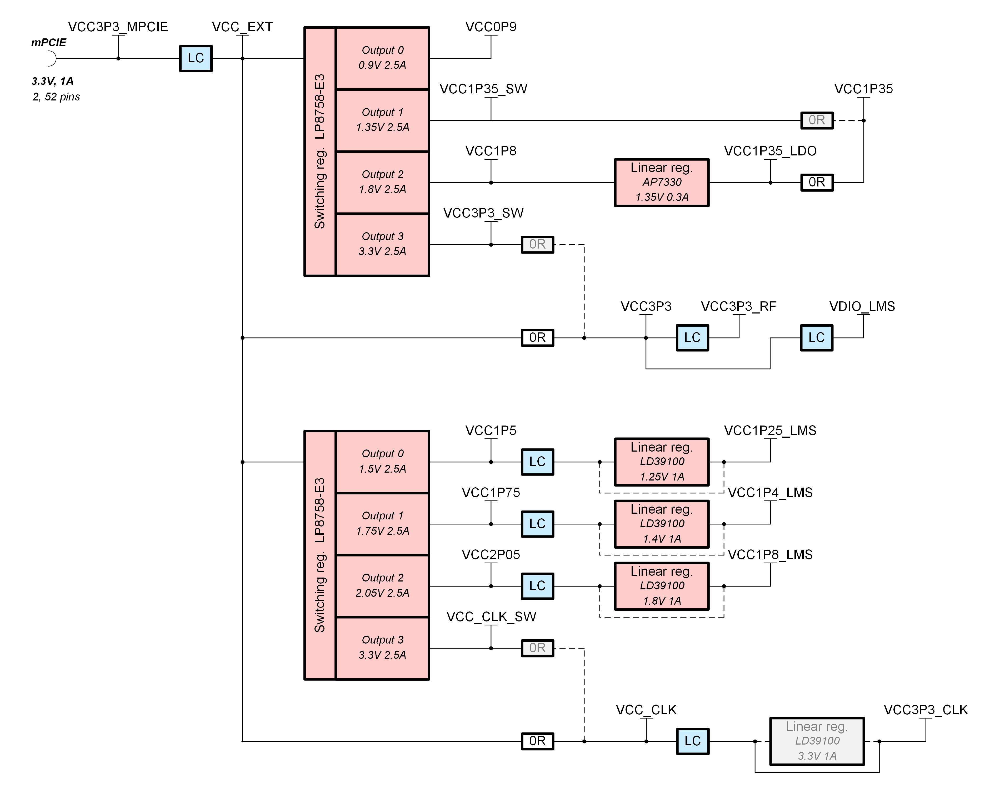
  
  Figure 9 LimeSDR Micro v1.2 board power distribution block diagram

Differencies from LimeSDR Micro v1.1
***********************************

This section covers LimeSDR Micro v1.2 board changes compared to LimeSDR Micro v1.1.

Changes introduction
====================

LimeSDR Micro v1.2 board is designed using LimeSDR Micro v1.1 (mPCIe) project as base. 
The reference clock structure has been changed, replacing the separate general-purpose buffers with one dedicated clock buffer. 
This should improve clock parameters such as phase jitter. A JST connector for RFCTL signals has also been added. 
Added the ability to supply an external 3.3V voltage to the lines of that voltage, bypassing the switching regulators and thus avoiding the voltage drop.

RF transceiver changes
======================

Replaced single LMS_CLK by two separate LMS_TxPLL_CLK and LMS_RxPLL_CLK clocks as shown in Figure 10. 

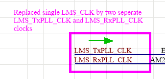
  
  Figure 10 LMS7002M clock changes

Baseband processor changes
==========================

Changed reset circuit as shown in Figure 11.

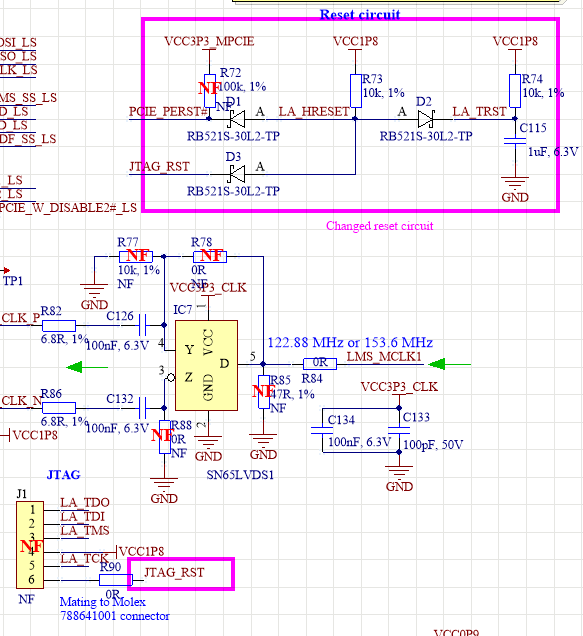
  
  Figure 11 Baseband processor reset circuit changes

Disconnected LA_GPIO_05, LA_GPIO_06 and LA_CFG_BOOT_SRC1 from TDD control signals and connected to testpoints as shown in Figure 12.

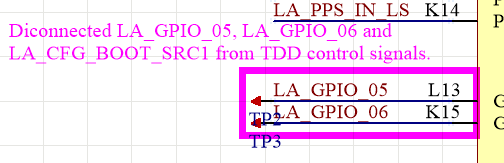
  
  Figure 12 Baseband processor signal changes

Miscellaneous changes
=====================

Renamed I2C expanders (IC15) GPB7 pin PCIE_RESERVED to EXP_GPB7 as shown in Figure 13 and connected it to RFCLT/GPIO connector (X8) pin 8.

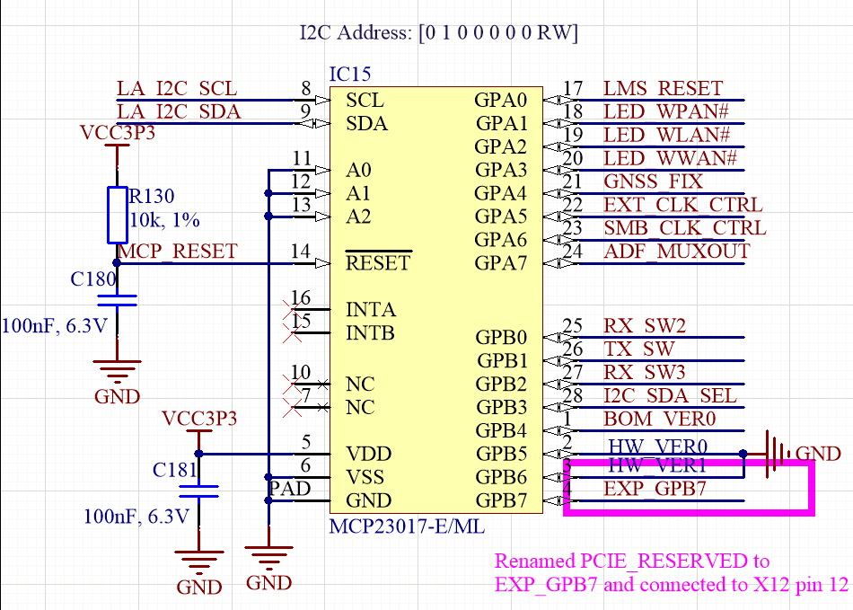
  
  Figure 13 I2C expander changes

Removed I2C connector (X6) and added RFCTL/GPIO 8-pin FPC connector (X8) in its place with signals listed below:

* TDD0_GPIO_LS connected to LA_CFG_BOOT_SRC0 (TXRX0).
* TDD1_GPIO_LS connected to LA_CFG_RST_HNDSHK (PA_EN).
* LNA1_EN_LS connected to LA_CFG_TEST_PORT_DIS (LNA1_EN).
* EXP_GPB7 connected to I2C expander.

New RFCTL/GPIO connector is shown in Figure 14.

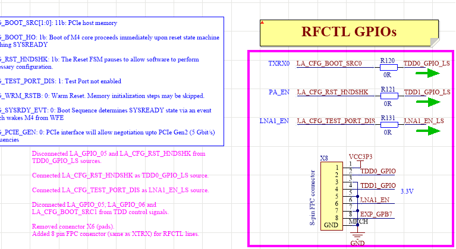
  
  Figure 14 New FRCTL/GPIO connector

Connected LNA1_EN_LS to level converter (1.8V to 3.3V) as shown in Figure 15.

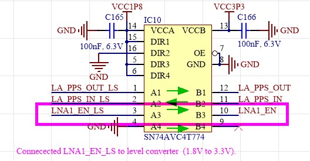
  
  Figure 15 LNA1_EN_LS signal changes

Changed mPCIe pin 45 PCIE_RESERVED to LNA1_EN as shown in Figure 16.

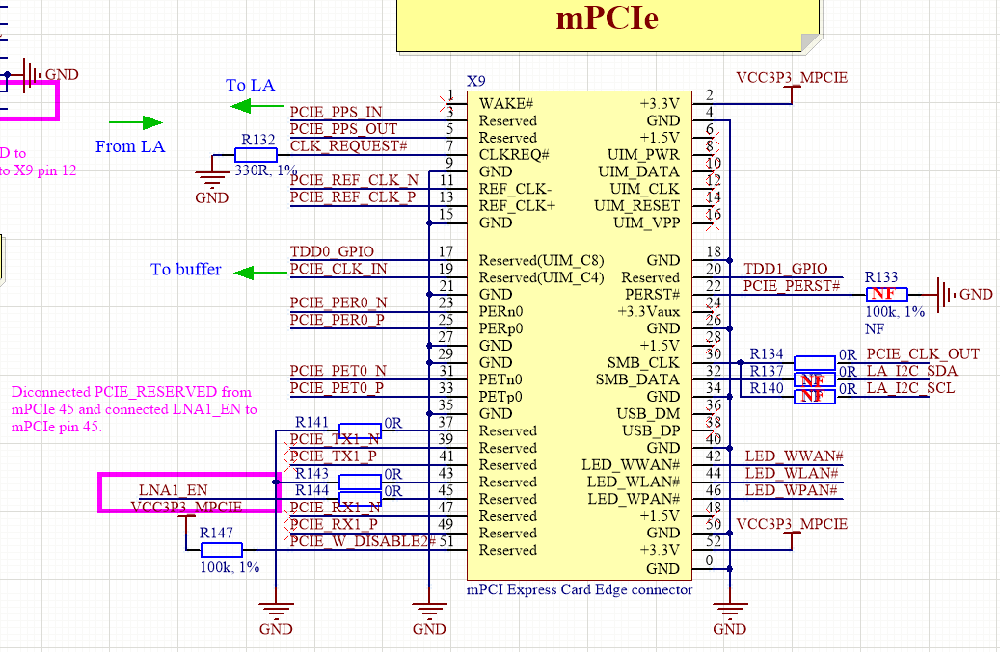
  
  Figure 15 mPCIe connector changes

Clock changes
=============

Clock buffers were changed to single LMK00105 resulting in new clock diagram given in Figure 16.

  
  Figure 16 LimeSDR Micro v1.2 board clock distribution block diagram

Added LMK buffer with 1.8V and 3.3V outputs as shown in Figure 17.

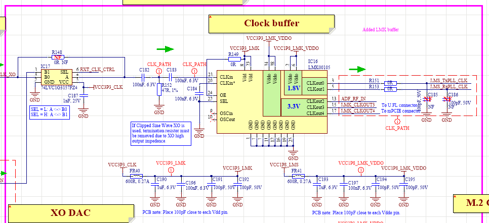
  
  Figure 17 New clock buffer LMK00105

Changed XO DAC from AD5693RACPZ-1RL7 (A grade, INL +-8LSB, internal reference, VLOGIC) to AD5693BCPZ-RL7 (B grade, INL +-3LSB, no internal reference, LDAC).

Changed R162 to NF, R161 to fit to tie LDAC pin low and DAC updates when new data is written to the input register.

Connected XO DAC VREF directly to external 2.5V reference source (R164 changed to 0R, R166 to NF).

all XO DAC changes are shown in figure 18.

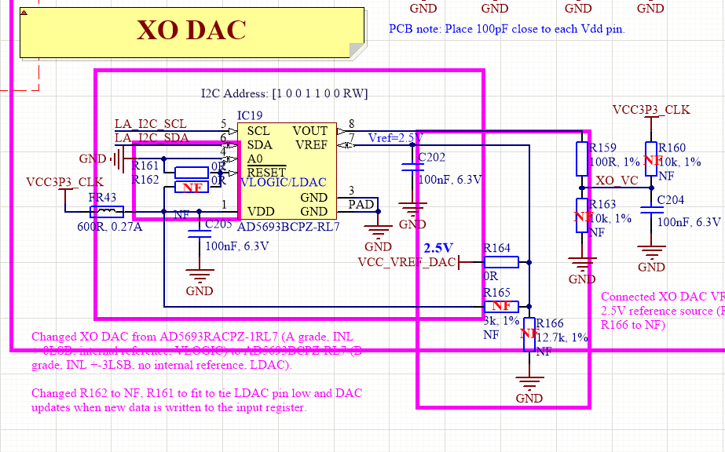
  
  Figure 18 XO DAC changes 

Power changes
=============

Renamed switching regulators outputs nets VCC3P3 and VCC_CLK to VCC3P3_SW and VCC_CLK_SW accordingly as shown in Figure 19.

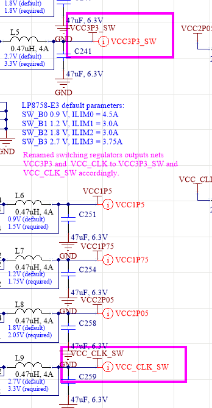
  
  Figure 19 Switching regulator changes 

Removed VCC1P8_CLK and VCCIO_CLK power nets and LC filters.

Added power rails selection for VCC3P3 and VCC_CLK (directly connection option to VCC_EXT) as shown in Figure 20.

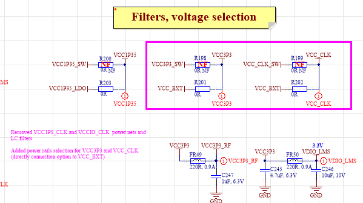
  
  Figure 20 voltage selection changes

Changed Voltage reference from LM4040C30FTADICT-ND (3.0V) to AS431ANTR-G1DICT-ND (2.5V). Also changed resistors accordingly as shown in Figure 21.

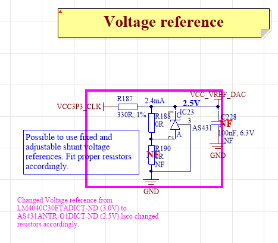
  
  Figure 21 voltage reference changes

PCB changes
===========

LimeSDR-Micro v1.2 is based on LimeSDR-Micro v1.1 layout.

New resulting PCB top side is shown in Figure 22 and bottom side is shown in Figure 23.

      Figure 22 LimeSDR Micro v1.2 top

      Figure 23 LimeSDR Micro v1.2 bottom